&nbsp;Prometheus 入門したので、導入の方法と動作確認の結果をまとめる。

<!--truncate-->

## Prometheus の基本情報

&nbsp;Prometheus はモニタリングとアラーティングを行うための OSS のソフトウェア。

:::note

[https://prometheus.io/docs/introduction/overview/](https://prometheus.io/docs/introduction/overview/)

> Prometheus is an open-source systems monitoring and alerting toolkit

:::

&nbsp;基本的な情報を以下にまとめる。

| 項目         | 情報                                                                                                                                                                                                     |
| ------------ | -------------------------------------------------------------------------------------------------------------------------------------------------------------------------------------------------------- |
| 開発元       | [Cloud Native Computing Foundation](https://www.cncf.io/)                                                                                                                                                |
| リリース     | マイナーリリースと LTS (Long Term Support) が存在する。<br/>マイナーリリースはリリースの 6 週間後、バグ修正を受け付けなくなる。<br/>LTS はバグ、セキュリティ関連、ドキュメントの修正を一年間受け付ける。 |
| 利用方法     | - [ソースコード](https://github.com/prometheus) <br/> - [コンパイル済みのバイナリ](https://prometheus.io/download/) <br/> - [Docker Image](https://hub.docker.com/u/prom)                                |
| ライセンス   | [Apache License 2.0](https://github.com/prometheus/prometheus/blob/main/LICENSE)                                                                                                                         |
| ドキュメント | [https://prometheus.io/docs/introduction/overview/](https://prometheus.io/docs/introduction/overview/)                                                                                                   |

:::note
[https://prometheus.io/docs/introduction/release-cycle/](https://prometheus.io/docs/introduction/release-cycle/)

> Every 6 weeks, a new Prometheus minor release cycle begins. After those 6 weeks, minor releases generally no longer receive bugfixes. If a user is impacted by a bug in a minor release, they often need to upgrade to the latest Prometheus release.

> Prometheus LTS only receive bug, security, and documentation fixes, but over a time window of one year.

:::

## Prometheus の構成

&nbsp;Prometheus は主に Exporter、Prometheus server、Alertmanager の三つのコンポーネントで構成される。

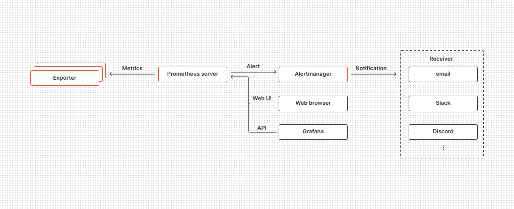

&nbsp;各コンポーネントの役割を以下にまとめる。

| コンポーネント    | 役割                                                                                                                                                                                                                                                               |
| ----------------- | ------------------------------------------------------------------------------------------------------------------------------------------------------------------------------------------------------------------------------------------------------------------ |
| Exporter          | モニタリングしたい対象のシステムからメトリクスを取得して、HTTP のエンドポイントとして公開する。                                                                                                                                                                    |
| Prometheus server | Exporter からメトリクスを取得して内部のデータベースに保存する。<br/>設定やコンポーネントの情報、保存したメトリクスを取得するための Web UI と API を提供する。<br/> メトリクスに条件を指定して、メトリクスが条件に引っ掛かったら Alertmanager に alert を送信する。 |
| Alertmanager      | Prometheus server から alert を受信して、alert のグルーピング、黙認、通知の送信を行う。                                                                                                                                                                            |

&nbsp;以降ではそれぞれのコンポーネントの詳細についてまとめる。

## Exporter

&nbsp;Exporter は以下の機能を提供する。

- モニタリングしたい対象のシステムからメトリクスを取得する。
- 取得したメトリクスを HTTP のエンドポイントとして公開する。

&nbsp;Exporter にはたくさんの種類があり、どんなメトリクスを取得したいかによって利用する Exporter を選定しなければならない。目当てのメトリクスを取得する良い Exporter がなければ、独自に Exporter を実装することもできる。以降では、メジャーな Exporter を動かして動作確認してみる。

### node_exporter

&nbsp;node_exporter は Prometheus が公式に提供している Exporter。ハードウェアと OS に関するメトリクスを取得できる。

#### インストール

&nbsp;node_exporter は[ソースコード](https://github.com/prometheus/node_exporter)、[コンパイル済みのバイナリ](https://prometheus.io/download/#node_exporter)、[Docker イメージ](https://hub.docker.com/r/prom/node-exporter)が提供されている。コンパイル済みのバイナリはダウンロードして任意のパスに配置するだけでよく、今回はこれを利用した。

```bash
$ curl -LO https://github.com/prometheus/node_exporter/releases/download/v1.6.1/node_exporter-1.6.1.linux-amd64.tar.gz
$ tar -zxvf node_exporter-1.6.1.linux-amd64.tar.gz
$ cd node_exporter-1.6.1.linux-amd64/
```

#### 起動

&nbsp;node_exporter を起動するには、配置したバイナリを実行するだけで良い。

```bash
$ ./node_exporter
```

&nbsp;ログの出力から分かるようにデフォルトでは 9100 番ポートで HTTP リクエストを受け付ける。

```
ts=2023-11-29T06:59:57.691Z caller=tls_config.go:274 level=info msg="Listening on" address=[::]:9100
ts=2023-11-29T06:59:57.691Z caller=tls_config.go:277 level=info msg="TLS is disabled." http2=false address=[::]:9100
```

#### HTTP エンドポイントの挙動

&nbsp;node_exporter が提供するエンドポイントに curl コマンドで HTTP リクエストを送信してみる。

```bash
$ curl http://localhost:9100/metrics -v
```

&nbsp;レスポンスボディは以下のような内容になっている。(一部抜粋)

```
...
# HELP node_cpu_seconds_total Seconds the CPUs spent in each mode.
# TYPE node_cpu_seconds_total counter
node_cpu_seconds_total{cpu="0",mode="idle"} 394.01
node_cpu_seconds_total{cpu="0",mode="iowait"} 0.4
node_cpu_seconds_total{cpu="0",mode="irq"} 0
node_cpu_seconds_total{cpu="0",mode="nice"} 0
node_cpu_seconds_total{cpu="0",mode="softirq"} 0.82
node_cpu_seconds_total{cpu="0",mode="steal"} 0
node_cpu_seconds_total{cpu="0",mode="system"} 1.78
node_cpu_seconds_total{cpu="0",mode="user"} 1.4
...
```

&nbsp;`#` で始まる行はコメント。`# HELP` を読んで分かるように、上記のメトリクス `node_cpu_seconds` はサーバーが起動してから CPU が各モードだった秒数を示している。`#` 以外の各行は以下のフォーマットになっている。

```
metric_name [
  "{" label_name "=" `"` label_value `"` { "," label_name "=" `"` label_value `"` } [ "," ] "}"
] value [ timestamp ]
```

&nbsp;例えば上記のレスポンスに含まれる `node_cpu_seconds_total{cpu="0",mode="idle"} 394.01` は以下のような対応になる。

- `node_cpu_seconds_total` が `metric_name`
- `cpu` や `mode` が `label_name`
- `0` や `idle` が `label_value`
- `394.01` が `value`

&nbsp;上記のように、Prometheus ではメトリクスに metric_name と複数の label、timestamp をつけて、メトリクスを多次元のデータ構造として扱う。また Prometheus では時間軸に沿って順次発生する、同じ metric_name と label の組み合わせを持つメトリクスのシーケンスを time series と呼ぶ。Prometheus は全てのメトリクスを time series として管理している。

:::note

[https://prometheus.io/docs/instrumenting/exposition_formats/](https://prometheus.io/docs/instrumenting/exposition_formats/)

> Lines with a # as the first non-whitespace character are comments.

> The remaining lines describe samples (one per line) using the following syntax (EBNF):  
> ...

:::

:::note

[https://prometheus.io/docs/introduction/glossary/#time-series](https://prometheus.io/docs/introduction/glossary/#time-series)

> The Prometheus time series are streams of timestamped values belonging to the same metric and the same set of labeled dimensions. Prometheus stores all data as time series.

:::

## Prometheus server

&nbsp;Prometheus server は以下の機能を提供する。

- Exporter からメトリクスを取得して内部のデータベースに保存する。
- 設定やコンポーネントの情報、保存したメトリクスを取得するための Web UI と API を提供する。
- メトリクスに条件を指定して、メトリクスが条件に引っ掛かったら Alertmanager に alert を送信する。

&nbsp;以降ではこれらの機能についての設定と動作確認の結果についてまとめる。

### インストール

&nbsp;Prometheus server は[ソースコード](https://github.com/prometheus/prometheus)、[コンパイル済みのバイナリ](https://prometheus.io/download/#prometheus)、[Docker イメージ](https://hub.docker.com/r/prom/prometheus)が提供されている。コンパイル済みのバイナリはダウンロードして任意のパスに配置するだけでよく、今回はこれを利用した。

```bash
$ curl -LO https://github.com/prometheus/prometheus/releases/download/v2.45.0/prometheus-2.45.0.linux-amd64.tar.gz
$ tar -zxvf prometheus-2.45.0.linux-amd64.tar.gz
$ cd prometheus-2.45.0.linux-amd64
```

### 起動

&nbsp;Prometheus server を起動するには、配置したバイナリを、設定ファイルを指定して起動するだけで良い。設定ファイルの内容は後述する。

```bash
$ ./prometheus --config.file=./prometheus.yml
```

### Exporter からメトリクスを取得する

&nbsp;前述の node_exporter からメトリクスを取得する設定を作成する。任意のパスに prometheus.yml を作成して、以下の内容を記述する。

```yaml
global:
  scrape_interval: 15s

scrape_configs:
  - job_name: "demo_servers"
    static_configs:
      - targets: ["server1.local:9100"]
```

&nbsp;各設定の意味を以下にまとめる。
| 項目 | 値 | 意味 |
|--|--|--|
| global.scrape_interval | 15s | Exporter からメトリクスを取得 (scrape) する間隔を指定する。 |
| scrape_configs.job_name | "demo_servers" | job 名を指定する。|
| scrape_configs.static_configs.targets | ["server1.local:9100"] | instance を指定する。 |

&nbsp;なお、job、instance、target は以下の意味で使用される Prometheus の用語。

- instance ... Prometheus が scrape するエンドポイントのこと。
- job ... 同じ目的のための instance の集合。
- target ... Prometheus が scrape する対象の定義。instance の FQDN や scrape 時の認証情報、label の情報などが含まれる。

&nbsp;例えば、あるシステムが数台のサーバーで冗長構成をとっている場合、各サーバーで動作する Exporter のエンドポイントは instance であり、それらの instance を job にまとめるイメージ。

:::note

[https://prometheus.io/docs/concepts/jobs_instances/](https://prometheus.io/docs/concepts/jobs_instances/)

> In Prometheus terms, an endpoint you can scrape is called an instance, usually corresponding to a single process. A collection of instances with the same purpose, a process replicated for scalability or reliability for example, is called a job.
>
> For example, an API server job with four replicated instances:
>
> job: api-server  
> instance 1: 1.2.3.4:5670  
> instance 2: 1.2.3.4:5671  
> instance 3: 5.6.7.8:5670  
> instance 4: 5.6.7.8:5671

[https://prometheus.io/docs/introduction/glossary/#target](https://prometheus.io/docs/introduction/glossary/#target)

> A target is the definition of an object to scrape. For example, what labels to apply, any authentication required to connect, or other information that defines how the scrape will occur.

:::

&nbsp;Prometheus server に設定を再読み込みさせるためには、Prometheus server のプロセスに SIGHUP を送信すれば良い。

```bash
$ kill -s SIGHUP <prometheus server の PID>
```

#### Service Discovery を使用する

&nbsp;前述の設定では `scrape_configs.static_configs.targets` の項目で target を静的に設定しているが、Prometheus server の Service Discovery という機能を使えば、target を動的に設定することもできる。  
&nbsp;Service Discovery にはたくさんの種類があるが、その一つの HTTP SD について設定方法をまとめる。HTTP SD を使用すると、Prometheus server から HTTP リクエストを送信して、レスポンスに含まれる target を設定することができる。
prometheus.yml を以下のように変更する。

```yaml
global:
  scrape_interval: 15s

scrape_configs:
  - job_name: "demo_servers"
    http_sd_configs:
      - url: "http://httpd.local/targets"
```

| 項目                | 値                           | 意味                                                                                    |
| ------------------- | ---------------------------- | --------------------------------------------------------------------------------------- |
| http_sd_configs.url | "http://httpd.local/targets" | target を取得するために Prometheus server が HTTP リクエストを送信する URL を指定する。 |

&nbsp;HTTP サーバーは target をレスポンスとして返却する際に、以下のルールを守る必要がある。

- レスポンスコードは 200 を使用すること
- Content-Type ヘッダーの値は application/json を使用すること
- ボディーは以下のフォーマットであること

```json
[
  {
    "targets": [ "<host>", ...  ],
    "labels": {
      "<label name>": "<label value>",
      ...
    }
  },
  ...
]
```

| 項目    | 値                                        | 意味                                                            |
| ------- | ----------------------------------------- | --------------------------------------------------------------- |
| targets | `["<host>", ... ]`                        | instance の FQDN を指定する。                                   |
| labels  | `{"<label name>": "<label value>", ... }` | scrape する際に Prometheus server が付与する label を指定する。 |

:::note
[https://prometheus.io/docs/prometheus/latest/http_sd/](https://prometheus.io/docs/prometheus/latest/http_sd/)
:::

### 保存されたメトリクスを確認する

&nbsp;Prometheus server が提供している Web UI にアクセスして、Prometheus server が scrape したメトリクスを確認する。
デフォルトでは Prometheus server は 9090 番ポートでパス `/graph` で Web UI を提供している。

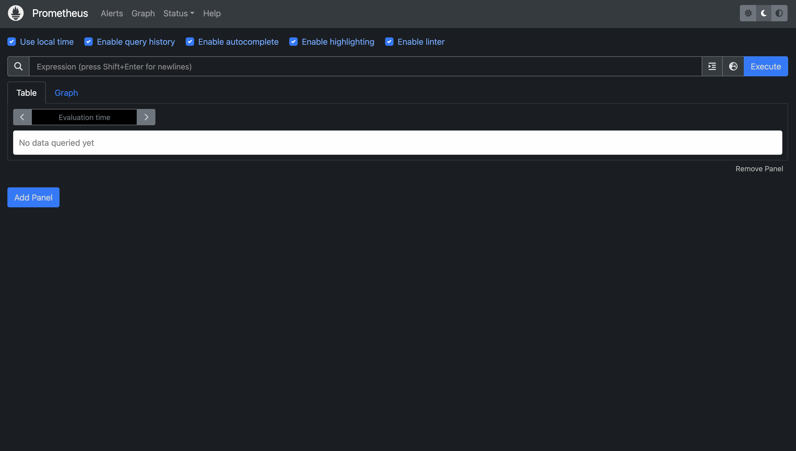

&nbsp;画面上部の「Expression (press Shift+Enter for newlines)」と書かれたフォームに PromQL (Prometheus Query Language) を記述することでメトリクスを検索することができる。前述の metric name `node_cpu_seconds_total` を検索すると、以下のようにメトリクスが表示される。

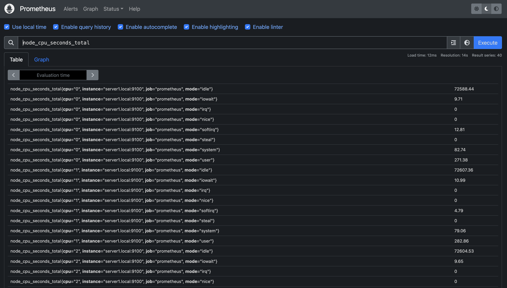

#### Prometheus server が自動で生成する label と time series

&nbsp;前述の node_exporter からの HTTP レスポンスと上記の Web UI の出力を見比べると、Web UI に出力されているメトリクスには node_exporter からの HTTP レスポンスには存在しなかった `job` label と `instance` label が存在することがわかる。これは Prometheus server が scrape した際に自動で付与する label で以下の値が入る。

| label name | label value                                                                                                |
| ---------- | ---------------------------------------------------------------------------------------------------------- |
| job        | prometheus.yml の scrape_configs.job_name                                                                  |
| instance   | prometheus.yml の scrape_configs.static_configs.targets で指定した instance の 「\<host\>:\<port\>」部分。 |

&nbsp;また、Prometheus server は scrape した際に以下の time series を自動で生成する。

- up
- scrape_duration_seconds
- scrape_samples_post_metric_relabeling
- scrape_samples_scraped
- scrape_series_added

&nbsp;中でも up は instance の死活監視に利用できる便利な time series で、値として instance が scrape 可能なら `1` そうでなければ `0` を保持する。

#### PromQL の評価結果

&nbsp;PromQL は、instant vector、range vector、scaler のいずれかに評価される。

&nbsp;instant vector は time series の集合で、全ての time series が同じ timestamp に対応する一つの値を持つ。例えば前述の node_cpu_seconds_total の評価結果は、各行に表示されている time series に値が一つだけなので、instant vector である。
&nbsp;instant vector に評価される PromQL の式を instant vector selector と呼ぶ。最も単純な instant vector selector は node_cpu_seconds_total のような metric name のみを指定したもの。この他に `{}` で label name と label value を指定することで特定の label を持つ instant vector のみを抽出することもできる。例えば以下の式である。

```
node_cpu_seconds_total{cpu="0", mode="idle"}
```

&nbsp;この式は `cpu` label が `"0"` かつ `mode` label が `"idle"` の instant vector を抽出する。`{}` 内では `=` 以外にも `!=` `=~` `!~` が使用できる。

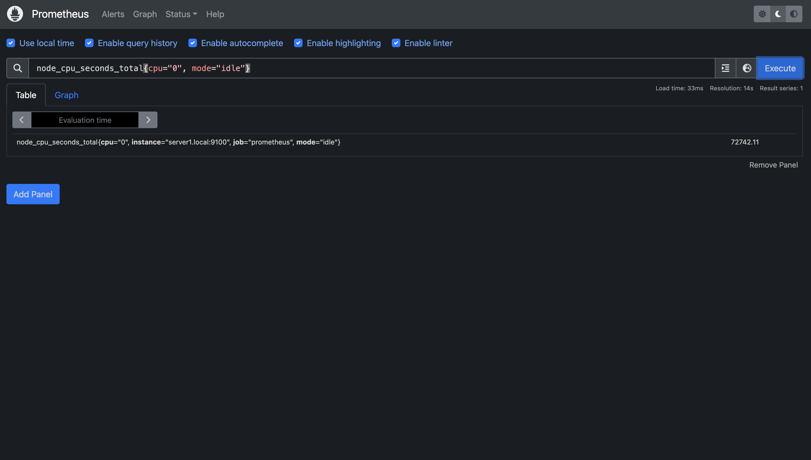

&nbsp;range vector は instant vector と同じく time series の集合だが、それぞれの time series が複数の値を持つ。instant vector selector の末尾に `[1m]` のように時間間隔を指定すると、その PromQL の評価時刻から指定時間前までの時間に含まれる timestamp を持つ値を含む range vector に評価される。例えば以下の式である。

```
node_cpu_seconds_total[1m]
```

&nbsp;この式の評価結果は、式が評価された時点の 5 分前から評価時点までの timestamp に対応する値を含む range vector である。時間間隔の指定には `ms` `s` `m` `h` `d` `w` `y`、さらにこれらの組み合わせが使用できる。range vector に評価される PromQL の式を range vector selector と呼ぶ。

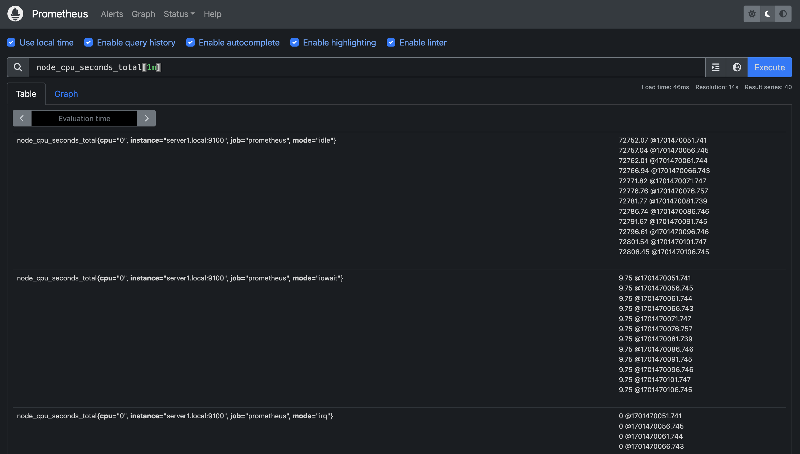

&nbsp;scaler はシンプルな浮動小数点数で、以下のように表示される。

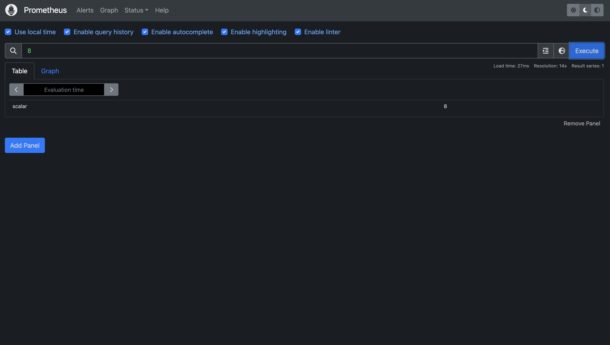

#### Offset modifier と @ modifier

&nbsp;前述の instant vector selector `node_cpu_seconds_total` は、式を評価した時点の値を含む instant vector に評価される。現在の値ではなく過去もしくは未来の値を取得したい場合は `offset` modifier もしくは `@` modifier を使用する。例えば式の評価時点から 5 分前の値を取得したければ、以下のように PromQL を記述すれば良い。

```
node_cpu_seconds_total offset 5m
```

式の評価時点を変更するには以下のように PromQL を記述すれば良い。

```
node_cpu_seconds_total @ 1701453600
```

`offset` と `@` を両方使用することも可能。

```
node_cpu_seconds_total offset 5m @ 1701453600
```

#### Arithmetic binary operators (算術二項演算子)

&nbsp;PromQL では Arithmetic binary operator として加算 `+` 減算 `-` 乗算 `*` 除算 `/` 剰余 `%` 累乗 `^` が使用できる。これらは scaler と scaler、instant vector と scaler、instant vector と instant vector の間で定義されている。

##### scaler と scaler

&nbsp;両方の scaler に operator が適用された結果である別の scaler に評価される。

```
1 + 1 = 2
```

##### instant vector と scaler

&nbsp;vector 内の全ての time series の値に operator が適用される。

```
some_metric{some_label="value1"} 5       some_metric{some_label="value1"} 6
some_metric{some_label="value2"} 1 + 1 = some_metric{some_label="value2"} 2
some_metric{some_label="value3"} 3       some_metric{some_label="value3"} 4
```

##### instant vector と instant vector

&nbsp;operator の左側の vector の各 time series の値と、operator の右側の vector 内の vector matching によって選ばれた time series の値に operator が適用される。vector matching については後述する。metric name は無くなる。operator の右側の vector の time series の中で vector matching により選ばれなかった time series は結果の vector には含まれない。

```
some_metric{some_label="value1"} 5   some_metric{some_label="value1"} 2   {some_label="value1"} 7
some_metric{some_label="value2"} 1 + some_metric{some_label="value2"} 4 = {some_label="value2"} 5
some_metric{some_label="value3"} 3   some_metric{some_label="value3"} 6   {some_label="value3"} 9
```

#### Trigonometric binary operators (三角二項演算子)

&nbsp;PromQL では Trigonometric binary operator として `atan2` が利用可能。これは Go の math package の Atan2 をベースにしている。Atan2 は 以下のように使えて、y/x の tangent を返す。Trigonometric binary operator の振る舞いは Arithmetic binary operator と同じ。

```go
func Atan2(y, x float64) float64
```

#### Comparison binary operators (比較二項演算子)

&nbsp;PromQL では Comparison binary operator として `==` `!=` `>` `<` `>=` `<=` が使用できる。デフォルトでは結果をフィルターする動作になるが、operator の後に `bool` modifier をつけると比較の結果を `0` (false) `1` (true) で返す。これらは scaler と scaler、instant vector と scaler、instant vector と instant vector との間で定義されている。

##### scaler と scaler

&nbsp;両方の scaler の比較結果を `0` (false)、`1` (true) で返す。scaler の間で Comparison binary operator を使用する場合は `bool` modifier が必須。

```
1 == bool 1 = 1
1 == bool 2 = 0
```

##### instant vector と scaler

&nbsp;vector 内の time series の値と scaler を比較して、結果が `0` (false) である time series を取り除く。

```
some_metric{some_label="value1"} 5
some_metric{some_label="value2"} 2 == 2 = some_metric{some_label="value2"} 2
some_metric{some_label="value3"} 3
```

&nbsp;`bool` modifier が与えられた場合は、time series を取り除く代わりに `0` (false) が、その他の time series には `1` (true) が返される。この場合 metric name は取り除かれる。

```
some_metric{some_label="value1"} 5             {some_label="value1"} 0
some_metric{some_label="value2"} 2 == bool 2 = {some_label="value2"} 1
some_metric{some_label="value3"} 3             {some_label="value3"} 0
```

##### instant vector と instant vector

&nbsp;operator の左側の vector の各 time series の値と、operator の右側の vector 内の vector matching によって選ばれた time series を比較した結果、`0` (false) である time series を取り除く。vector matching については後述する。metric name は無くなる。operator の右側の vector の time series の中で vector matching により選ばれなかった time series は結果の vector には含まれない。

```
some_metric{some_label="value1"} 5    some_metric{some_label="value1"} 5   {some_label="value1"} 5
some_metric{some_label="value2"} 2 == some_metric{some_label="value2"} 2 = {some_label="value2"} 2
some_metric{some_label="value3"} 3    some_metric{some_label="value3"} 6
```

&nbsp;`bool` modifier が与えられた場合は、time series を取り除く代わりに `0` (false) が、その他の time series には `1` (true) が返される。

```
some_metric{some_label="value1"} 5         some_metric{some_label="value1"} 5   {some_label="value1"} 1
some_metric{some_label="value2"} 2 == bool some_metric{some_label="value2"} 2 = {some_label="value2"} 1
some_metric{some_label="value3"} 3         some_metric{some_label="value3"} 6   {some_label="value3"} 0
```

#### Logical/set binary operators

&nbsp;PromQL では Logical/set binary operator として `and` `or` `unless` を使用できる。これらは instant vector と instant vector の間でのみ定義されている。

&nbsp;`vector1 and vector2` の結果には vector1 に含まれる time series のうち、vector2 に完全に label set が一致する time series が存在するもののみが含まれる別の vector が返される。

```
some_metric{some_label="value1"} 5     some_metric{some_label="value1"} 3   some_metric{some_label="value1"} 5
some_metric{some_label="value2"} 2 and some_metric{some_label="value2"} 1 = some_metric{some_label="value2"} 2
some_metric{some_label="value3"} 3     some_metric{some_label="value4"} 2
```

&nbsp;`vector1 or vector2` の結果には vector1 に含まれる全ての time series と、vector2 含まれる time series のうち、vector1 に含まれる time series の中に label set が一致する time series が存在しないものを含む含む別の vector が返される。

```
some_metric{some_label="value1"} 5    some_metric{some_label="value1"} 3   some_metric{some_label="value1"} 5
some_metric{some_label="value2"} 2 or some_metric{some_label="value2"} 1 = some_metric{some_label="value2"} 2
some_metric{some_label="value3"} 3    some_metric{some_label="value4"} 2   some_metric{some_label="value3"} 3
                                                                           some_metric{some_label="value4"} 2
```

#### Vector matching

&nbsp;二つの vector 間の操作では、operator の左側の vector の各要素に match する operator の右側の vector の要素を探す。基本的な matching の振る舞いとして以下の二つのタイプがある。

##### one-to-one vector match

&nbsp;one-to-one vector match は `vector1 <operator> vector2` のデフォルトの操作である。
one-to-one vector match は二つの vector の要素からユニークなペアを見つける。
二つの要素は label name と label value が完全に一致する場合に match する。

`ignoring` keyword は matching から除外する label を指定できる。

```
vector1 <operator> ignoring(<label_name>, ...) vector2
```

`on` keyword は matching で考慮する label の集合を指定する。

```
vector1 <operator> on(<label_name>, ...) vector2
```

&nbsp;例えば、以下の二つの vector がある場合を考える。

```
# vector1
method_code:http_errors:rate5m{method="get", code="500"}  24
method_code:http_errors:rate5m{method="get", code="404"}  30
method_code:http_errors:rate5m{method="put", code="501"}  3
method_code:http_errors:rate5m{method="post", code="500"} 6
method_code:http_errors:rate5m{method="post", code="404"} 21

# vector2
method:http_requests:rate5m{method="get"}  600
method:http_requests:rate5m{method="del"}  34
method:http_requests:rate5m{method="post"} 120
```

&nbsp;以下の式を評価する。

```
method_code:http_errors:rate5m{code="500"} / ignoring(code) method:http_requests:rate5m
```

&nbsp;上記の式は method 毎の HTTP リクエスト数に対する code が "500" のエラー割合を返す。入力を見ると、method:http_requests:rate5m には code label がないので ignoring(code) を入れないと、method_code:http_errors:rate5m と method:http_requests:rate5m の one-to-one vector match の結果が空になってしまう。

```
{method="get"}  0.04            //  24 / 600
{method="post"} 0.05            //   6 / 120
```

&nbsp;上記の式は `on` keyword を使うと以下のように書き換えられる。

```
method_code:http_errors:rate5m{code="500"} / on(code) method:http_requests:rate5m
```

##### many-to-one/one-to-many vector match

&nbsp;many-to-one/one-to-many match は "one" 側の各要素が "many" 側の複数の要素に match する。
`group_left` `group_right` modifier を使って、左右どちらの vector が "many" 側なのかを明示的に指定しなければならない。

```
<vector expr> <bin-op> ignoring(<label list>) group_left(<label list>) <vector expr>
<vector expr> <bin-op> ignoring(<label list>) group_right(<label list>) <vector expr>
<vector expr> <bin-op> on(<label list>) group_left(<label list>) <vector expr>
<vector expr> <bin-op> on(<label list>) group_right(<label list>) <vector expr>
```

&nbsp;例えば、以下の二つの vector がある場合を考える。

```
# vector1
method_code:http_errors:rate5m{method="get", code="500"}  24
method_code:http_errors:rate5m{method="get", code="404"}  30
method_code:http_errors:rate5m{method="put", code="501"}  3
method_code:http_errors:rate5m{method="post", code="500"} 6
method_code:http_errors:rate5m{method="post", code="404"} 21

# vector2
method:http_requests:rate5m{method="get"}  600
method:http_requests:rate5m{method="del"}  34
method:http_requests:rate5m{method="post"} 120
```

&nbsp;以下の式を実行する。

```
method_code:http_errors:rate5m / ignoring(code) group_left method:http_requests:rate5m
```

&nbsp;one-to-one match の例と式を見比べてみる。

```
# one-to-one
method_code:http_errors:rate5m{code="500"} / ignoring(code)            method:http_requests:rate5m
# one-to-many / many-to-one
method_code:http_errors:rate5m             / ignoring(code) group_left method:http_requests:rate5m
```

&nbsp;上記の式は以下の vector に評価される。

```
method_code:http_errors:rate5m{method="get", code="500"}  24
method_code:http_errors:rate5m{method="get", code="404"}  30
method_code:http_errors:rate5m{method="put", code="501"}  3
method_code:http_errors:rate5m{method="post", code="500"} 6
method_code:http_errors:rate5m{method="post", code="404"} 21
```

&nbsp;入力の vector1 には method label の値（`"get"`）に対して複数の code label の値（`"500"`と`"404"`）が存在する。
vector2 の要素を vector1 の複数の要素に match させることになるので、many は vector1 側であり、これを指定するために `group_left` をつける必要がある。

#### Binary Operator の優先順位

&nbsp;優先順位の高い方から並べると以下の順番になる。

- `^`
- `*` `/` `%` `atan2`
- `+` `-`
- `==` `!=` `<=` `<` `>=` `>`
- `and` `unless`
- `or`

&nbsp;優先順位の同じ operator は左から順に処理される。

#### Aggregation operators

&nbsp;aggregation operator は一つの instant vector の要素から、集約された値を持つ新しい instant vector を返す。以下の operator が利用できる。

- `sum`
- `min`
- `max`
- `avg`
- `group`
- `stddev`
- `stdvar`
- `count`
- `count_values`
- `bottomk`
- `topk`
- `quantile`

`sum` の場合、以下のように利用できる。

```
sum(vector1)
```

&nbsp;この式は vector1 内の全ての time series の値の合計値を値に持つ time series に評価される。
vector1 内の全ての time series ではなく、特定の label 毎に合計を算出したい場合は `by` を使用する。なお、`by` で指定しなかった label は結果の vector には含まれない。

```
sum by (<label_name>, ...) (vector1)
# or
sum (vector1) by (<label_name>, ...)
```

&nbsp;逆に特定の label 以外の label set 毎に合計を算出したい場合は `without` を使用する。なお、`without` で指定しなかった label は結果の vector に含まれる。

```
sum without (<label_name>, ...) (vector1)
# or
sum (vector1) without (<label_name>, ...)
```

&nbsp;`count_values` `quantile` `topk` `bottomk` の引数には vector の他に parameter を指定する。例えば `topk` を使って上位 5 つの time series を取得する場合は以下のように記述する。

```
topk(5, vector1)
```

&nbsp;以上の内容をまとめると、aggregation operator を利用する場合の構文は以下のようになる。

```
<aggr-op> [without|by (<label list>)] ([parameter,] <vector expression>)
# or
<aggr-op>([parameter,] <vector expression>) [without|by (<label list>)]
```

#### Functions

&nbsp;PromQL で利用可能な関数が以下のページに列挙されている。必要に応じて確認すると良い。

[https://prometheus.io/docs/prometheus/latest/querying/functions/](https://prometheus.io/docs/prometheus/latest/querying/functions/)

### Recording Rule を作成する

&nbsp;Prometheus server の機能に話を戻す。結果が数千の time series になるような PromQL を都度実行すると Prometheus server の動作が遅くなることがある。このような式は recording rule として Prometheus server に設定しておくと、Prometheus server が定期的に式を実行して、結果を保存しておいてくれる。以下は recording rule を設定する例。

&nbsp;prometheus.yml を以下のように変更する。

```yaml
global:
  scrape_interval: 15s
  evaluation_interval: 15s

rule_files:
  - "rules/*.yml"

scrape_configs:
  - job_name: "demo_servers"
    static_configs:
      - targets: ["server1.local:9100"]
```

| 項目                       | 値             | 意味                                          |
| -------------------------- | -------------- | --------------------------------------------- |
| global.evaluation_interval | `15s`          | rule を評価する時間間隔を指定する。           |
| rule_files                 | `"rules/*yml"` | rule の設定を読み込むディレクトリを指定する。 |

&nbsp;prometheus.yml と同じディレクトリに `rules` ディレクトリを作成して、以下の内容で `rules/cpu_usage.record.yml` を作成する。

```yaml
groups:
  - name: cpu_usage
    rules:
      - record: node_cpu_usage_seconds_1m
        expr: node_cpu_seconds_total - node_cpu_seconds_total offset 1m

      - record: node_cpu_usage_percentage_1m
        expr: round(node_cpu_usage_seconds_1m / 60 * 100, 0.01)

      - record: node_total_cpu_usage_percentage_1m
        expr: round(avg without (cpu) (node_cpu_usage_percentage_1m), 0.01)
```

| 項目          | 値                                                          | 意味                                                                                                                                            |
| ------------- | ----------------------------------------------------------- | ----------------------------------------------------------------------------------------------------------------------------------------------- |
| groups.name   | `cpu_usage`                                                 | rule group 名。<br/>group 内の rule は prometheus.yml に指定した global.evaluation_interval もしくは groups.interval の間隔で直列に実行される。 |
| groups.record | `node_cpu_usage_seconds_1m`                                 | rule を実行した結果得られる time series の metric name。                                                                                        |
| groups.expr   | `node_cpu_seconds_total - node_cpu_seconds_total offset 1m` | 実行する PromQL の式。                                                                                                                          |

&nbsp;Prometheus server の設定を再読み込み後、Web UI で上記の recording rule に設定した `node_cpu_usage_seconds_1m` を metric name として使用することができる。

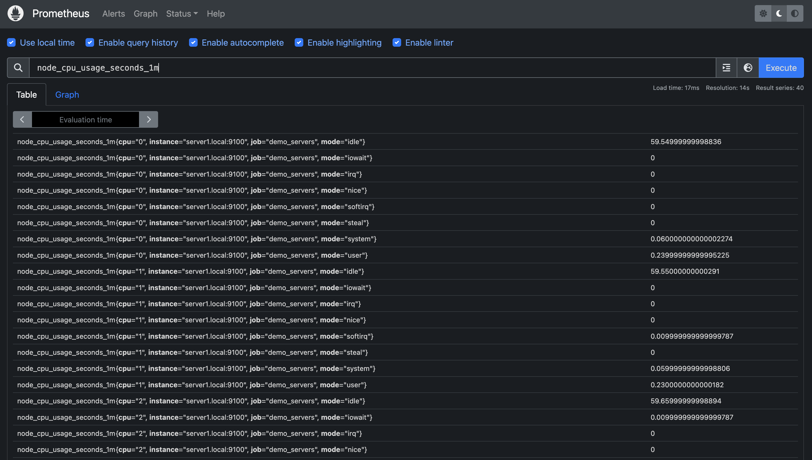

### Alerting Rule を作成する

&nbsp;メトリクスに対する条件を alerting rule として設定しておくことで、メトリクスが条件に一致したら Alertmanager に alert を送信することができる。以下は 1 分間の idle mode の CPU 使用率が 20 % を下回ったら alert を送信する alerting rule を設定する例。

&nbsp;prometheus.yml を以下のように変更する。

```yaml
global:
  scrape_interval: 15s
  evaluation_interval: 15s

alerting:
  alertmanagers:
    - static_configs:
        - targets:
            - "alertmanager.local:9093"

rule_files:
  - "rules/*.yml"

scrape_configs:
  - job_name: "demo_servers"
    static_configs:
      - targets: ["server1.local:9100"]
```

| 項目                                         | 意味                                             |
| -------------------------------------------- | ------------------------------------------------ |
| alerting.alertmanagers.static_config.targets | alert を送信する Alertmanager の宛先を指定する。 |

以下の内容で `rules/cpu_usage.alert.yml` を作成する。

```yaml
groups:
  - name: cpu_usage_alert
    rules:
      - alert: cpu_usage_over_80_percent
        expr: node_total_cpu_usage_percentage_1m{mode="idle"} < 20
        labels:
          severity: critical
        annotations:
          title: High CPU usage
          description: CPU usage on {{ $labels.instance }} was over 80%.
```

| 項目                     | 意味                                                                                                                                   |
| ------------------------ | -------------------------------------------------------------------------------------------------------------------------------------- |
| groups.rules.alert       | alert 名を指定する。                                                                                                                   |
| groups.rules.expr        | 実行する PromQL を指定する。<br/>指定した PromQL の結果として得られた time series は pending 状態もしくは firing 状態の alert になる。 |
| groups.rules.labels      | alert に付与する任意の label を指定する。                                                                                              |
| groups.rules.annotations | alert に付与する任意の annotation を指定する。annotation は label だが、alert の説明文など、長い文字列を値として保持する。             |

&nbsp;Prometheus server の設定を再読み込み後、Web UI の Alerts タブで alert の状態が確認できる。

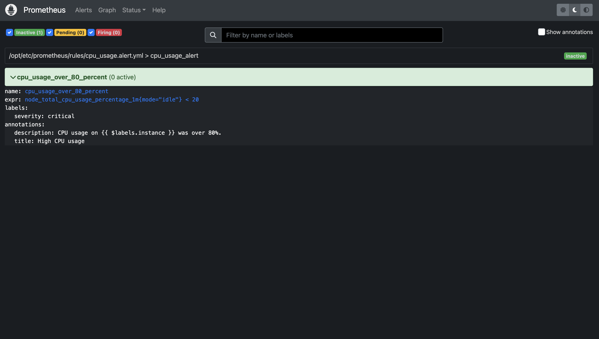

&nbsp;alert が発火すると以下のような表示になる。

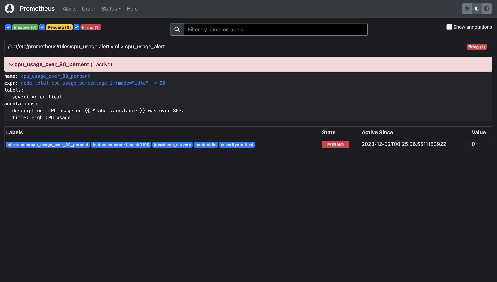

&nbsp;active 状態（firing 状態と pending 状態）の alert は　 Graph タブで以下の PromQL を実行することでも確認できる。結果には active 状態の alert のみが表示される。

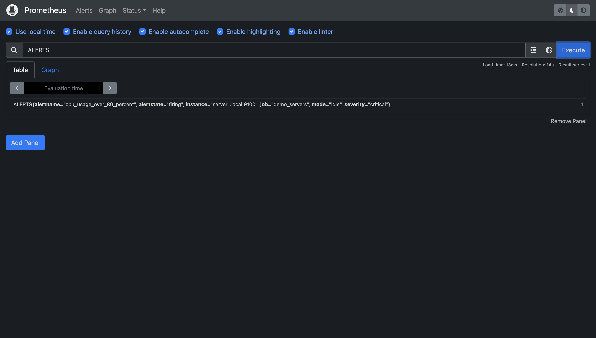

## Alertmanager

Alertnamager は以下の機能を提供する。

- alert を Prometheus server から受信する。
- alert を集約 (grouping) する。
- alert を黙認 (inhibition、silence) する。
- alert を外部システムに通知する。

&nbsp;前述の Prometheus server から alert を受信する Alertmanager を構築して、これらの動作を確認する。

### インストール

&nbsp;Alertnamager は[ソースコード](https://github.com/prometheus/alertmanager)、[コンパイル済みのバイナリ](https://prometheus.io/download/#alertmanager)、[Docker イメージ](https://hub.docker.com/r/prom/alertmanager)が公開されている。コンパイル済みのバイナリはダウンロードして任意のパスに配置するだけでよく、今回はこれを利用した。

```bash
$ curl -LO https://github.com/prometheus/alertmanager/releases/download/v0.26.0/alertmanager-0.26.0.linux-amd64.tar.gz
$ tar -zxvf alertmanager-0.26.0.linux-amd64.tar.gz
$ cd alertmanager-0.26.0.linux-amd64
```

### 起動

&nbsp;Alertmanager を起動するには、配置したバイナリを、設定ファイルを指定して起動するだけで良い。設定ファイルの内容は後述する。

```bash
$ ./alertmanager --config.file=./alertmanager.yml
```

### Prometheus server から alert を受信する

&nbsp;alert を受信したら `http://notification-api.local:5001/` に通知のための HTTP リクエストを送信する設定を作成する。任意のパスに alertmanager.yml を作成して、以下の内容を記述する。

```yaml
route:
  receiver: "some_api"

receivers:
  - name: "some_api"
    webhook_configs:
      - url: "http://notification-api.local:5001"
```

| 項目                          | 意味                                                         |
| ----------------------------- | ------------------------------------------------------------ |
| route.receiver                | receivers.name を指定する。                                  |
| receivers.name                | receiver (通知の送信先となる外部システム) の名前を指定する。 |
| receivers.webhook_configs.url | 通知のための HTTP リクエストを送信する URL を指定する。      |

&nbsp;Alertmanager に設定を再読み込みさせるためには、Alertmanager のプロセスに SIGHUP を送信すれば良い。

```bash
$ kill -s SIGHUP <alertmanager の PID>
```

&nbsp;Alertmanager は Web UI を提供していて、デフォルトでは 9093 番ポート、パス `/#/alerts` でアクセスできる。

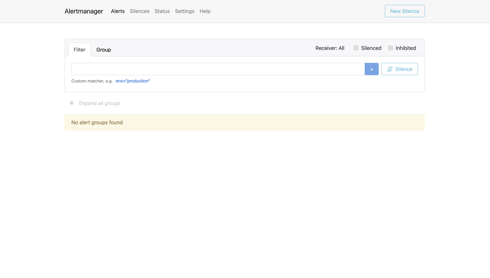

&nbsp;前述の Prometheus server から alert を送信すると、以下のように表示される。

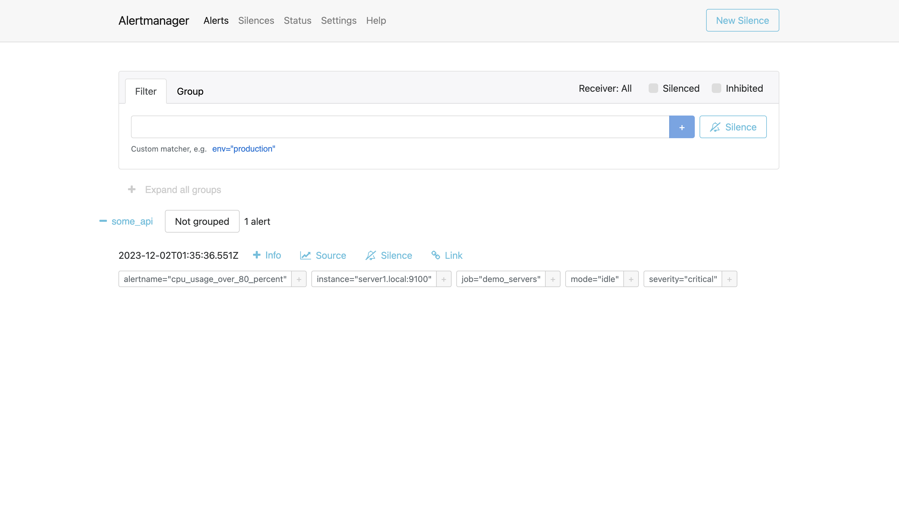

&nbsp;`http://notification-api.local:5001/` には alert の通知として以下の HTTP POST リクエストが送信される。

```json
{
  "receiver": "some_api",
  "status": "firing",
  "alerts": [
    {
      "status": "firing",
      "labels": {
        "alertname": "cpu_usage_over_80_percent",
        "instance": "server1.local:9100",
        "job": "demo_servers",
        "mode": "idle",
        "severity": "critical"
      },
      "annotations": {
        "description": "CPU usage on server1.local:9100 was over 80%.",
        "title": "High CPU usage"
      },
      "startsAt": "2023-12-02T02:50:21.551Z",
      "endsAt": "0001-01-01T00:00:00Z",
      "generatorURL": "http://881fa866c828:9090/graph?g0.expr=node_total_cpu_usage_percentage_1m%7Bmode%3D%22idle%22%7D+%3C+20&g0.tab=1",
      "fingerprint": "4856274d7c62ba14"
    }
  ],
  "groupLabels": {},
  "commonLabels": {
    "alertname": "cpu_usage_over_80_percent",
    "instance": "server1.local:9100",
    "job": "demo_servers",
    "mode": "idle",
    "severity": "critical"
  },
  "commonAnnotations": {
    "description": "CPU usage on server1.local:9100 was over 80%.",
    "title": "High CPU usage"
  },
  "externalURL": "http://091906e2b0b3:9093",
  "version": "4",
  "groupKey": "{}:{}",
  "truncatedAlerts": 0
}
```

### Routing tree

&nbsp;alertmanager.yml の route には、以下のように木構造の形で route を記述することができる（routing tree）。

```yaml
route:
  receiver: "some_api"
  routes: [- <route> ...]
```

&nbsp;routing tree の各 node には alert を match させる条件（matcher）を記述することができる。

```yaml
route:
  receiver: "some_api"
  routes:
    matchers: [- <matcher> ...]
```

`<matcher>` は以下の書式。

```yaml
<label name> = <label value>
# or
<label name> != <label value>
# or
<label name> =~ <label value>
# or
<label name> !~ <label value>
```

&nbsp;Alertmanager は alert を受信すると routing tree を使って以下の手順で alert を制御する。

1. 最上位の node (root node) から順に、alert が node に match するかを確認する。
2. node に alert が match したら、その子 node に alert が match するか確認する。
3. 子 node にも alert が match した場合、子 node に対して改めて 2. の手順を繰り返す。
4. 全ての子 node に alert が match しなかった場合、match した node の設定に従って alert を処理する。

### alert の grouping

&nbsp;route に設定を記述することで、複数の alert を grouping することができる。alert を grouping することで通知を group 単位にまとめることができ、大量の通知が一斉に送られてしまうことを防ぐ。route に以下の設定を追加する。

```yaml
route:
  receiver: "some_api"
  group_by: ["alertname"]
  group_wait: 30s
  group_interval: 5m

receivers:
  - name: "some_api"
    webhook_configs:
      - url: "http://notification-api.local:5001"
```

| 項目                 | 意味                                                                                                                                            |
| -------------------- | ----------------------------------------------------------------------------------------------------------------------------------------------- |
| route.group_by       | grouping する alert が一致しなければならない label の label name を指定する。                                                                   |
| route.group_wait     | 最初の alert が到着してから grouping の対象となる他の alert が到着するのを待機する時間を指定する。                                              |
| route.group_interval | alert の group に対しての通知が一度送信されてから、その group に追加の alert が到着した場合に新たな通知を送信するまでに待機する時間を指定する。 |

&nbsp;grouping の対象となる複数の alert が到着した場合の Alertmanager の挙動は以下の図のようになる。

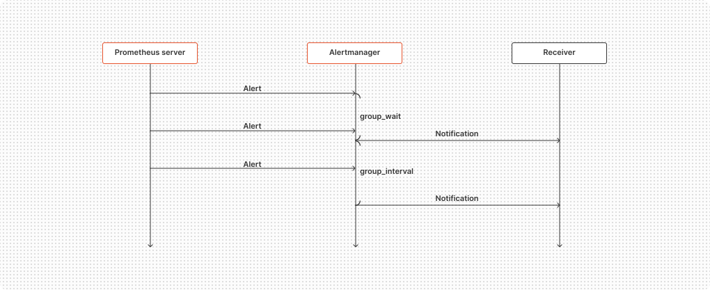

### alert の inhibition

&nbsp;alertmanager.yml に設定を記述することで、ある alert が発火していることを条件に他の alert の通知を mute することができる。以下の設定を追加する。

```yaml
route:
  receiver: "some_api"
  group_by: ["alertname"]
  group_wait: 30s
  group_interval: 5m

receivers:
  - name: "some_api"
    webhook_configs:
      - url: "http://notification-api.local:5001"

inhibit_rules:
  - source_matchers:
      - severity = 'critical'
    target_matchers:
      - severity =~ "warning|notice"
    equal: ["instance"]
```

| 項目                          | 意味                                                                             |
| ----------------------------- | -------------------------------------------------------------------------------- |
| inhibit_rules.source_matchers | inhibition を動作させるために存在しなければならない alert が満たすべき matcher。 |
| inhibit_rules.target_matchers | mute する対象の alert が満たすべき matcher。                                     |
| inhibit_rules.equal           | source と target の alert が一致しなければならない label の label name。         |

### alert の silence

&nbsp;route もしくは time_intervals に時間を指定することで、alert の通知を mute することができる。また Alertmanager の Web UI や API からの操作で設定することもできる。

### alert を外部システムに通知する

&nbsp;Alertmanager は receiver として Slack や Discord、email など、いろいろな外部システムをサポートしている。設定方法は以下を参照。

- [https://prometheus.io/docs/alerting/latest/configuration/#receiver-integration-settings](https://prometheus.io/docs/alerting/latest/configuration/#receiver-integration-settings)
