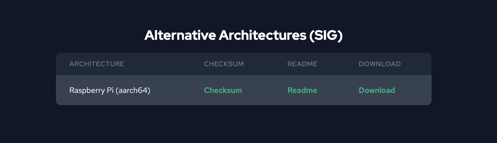
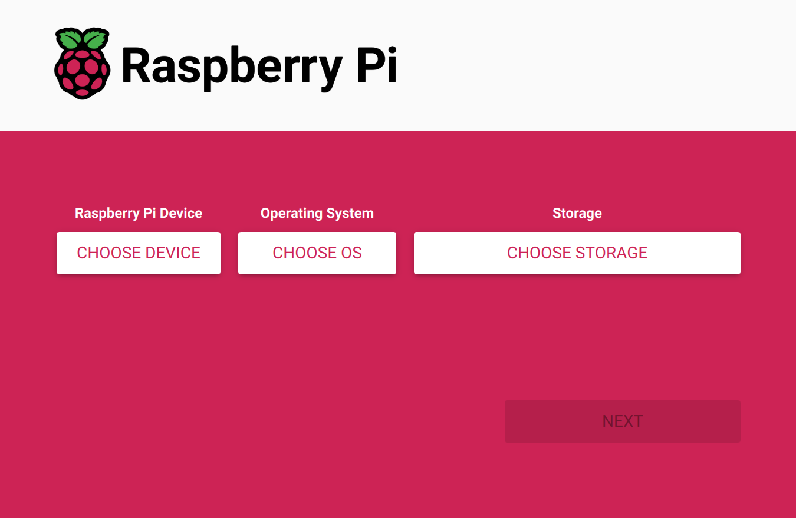
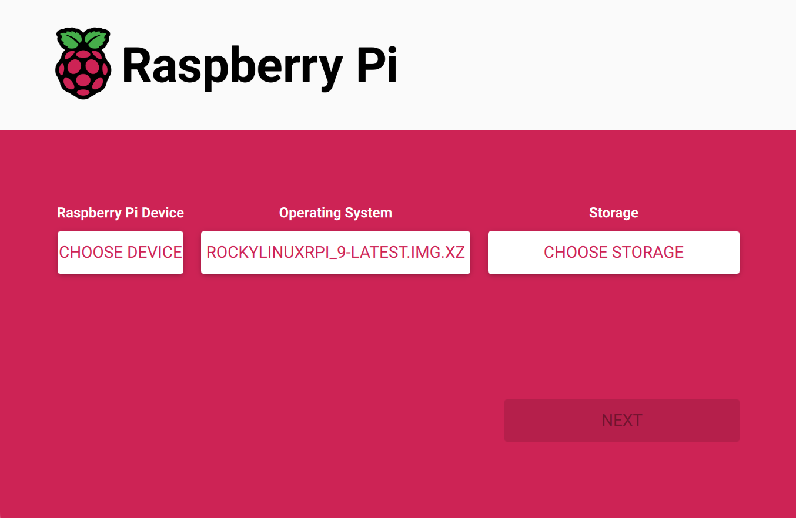

Rocky Linux 9 が Raspberry Pi 上で動作するようなので試してみる。

<!--truncate-->

## Rocky Linux Forum の投稿

Rocky Linux Forum の以下の投稿を見ると、Rocky Linux 9 が Raspberry Pi 上で動作する模様。

[https://forums.rockylinux.org/t/rocky-9-raspberry-pi-image-available/6919](https://forums.rockylinux.org/t/rocky-9-raspberry-pi-image-available/6919)

> Rocky Linux 9 for the Raspberry Pi (64-bit, models 3 and 4) is available for download under the Alternative Images page: https://rockylinux.org/alternative-images

## イメージのダウンロード

[https://rockylinux.org/alternative-images/](https://rockylinux.org/alternative-images/) から Raspberry PI (aarch64) 版のイメージをダウンロードする。



## SD カードの作成

[Raspberry Pi Imager](https://www.raspberrypi.com/software/) でダウンロードした OS イメージを SD カードに書き込む。

Raspberry Pi Imager を開いて `CHOOSE OS` ボタンをクリック。



`Use custom` を選択して、ダウンロードしたイメージを選択する。


あとは `CHOOSE STORAGE` で SD カードを選択して、Write するだけで良い。



## 起動

Raspberry Pi にディスプレイとキーボードを接続して起動する。  
ログインプロンプトが表示されたら、初期ユーザー `rocky` パスワード `rockylinux` でログインする。

## Wi-Fi の接続

network manager tool の UI を開く。

```bash
sudo nmtui
```

以下の手順で設定。

1. `Activate a connection` を選択。
2. Wi-Fi の中から使用する SSID を選択してパスワードを入力する。
3. `Back` > `Quit` の順で選択して終了する。

## Static IP address の設定

network manager tool の UI を開く。

```bash
sudo nmtui
```

1. `Edit a connection` を選択。
2. Static IP address を設定したいネットワークを選択。
3. `IPv4 CONFIGURATION` の欄で `<Show>` を選択。
4. `Addresses` `Gateway` `DNS servers` を設定。なお `Addresses` は `192.168.0.10/24` のように記述できる。
5. 設定が完了したら `<OK>` を選択。
6. `Back` > `Quit` の順で選択して終了する。

Static IP address の設定を読み込むため、再起動する。

```bash
sudo reboot -h now
```

## sshd の起動確認

以下のコマンドで確認したところ、sshd は何もしなくても既に起動していた。

```bash
ps aux | grep sshd
```

## 参考

- [https://raspberrytips.com/rocky-linux-raspberry-pi/](https://raspberrytips.com/rocky-linux-raspberry-pi/)
