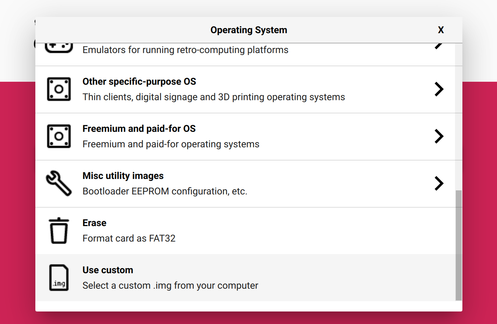

Rocky Linux 9 が Raspberry Pi 上で動作するようなので試してみる。

<!--truncate-->

## Rocky Linux Forum の投稿

Rocky Linux Forum の以下の投稿を見ると、Rocky Linux 9 が Raspberry Pi 上で動作する模様。

[https://forums.rockylinux.org/t/rocky-9-raspberry-pi-image-available/6919](https://forums.rockylinux.org/t/rocky-9-raspberry-pi-image-available/6919)

> Rocky Linux 9 for the Raspberry Pi (64-bit, models 3 and 4) is available for download under the Alternative Images page: https://rockylinux.org/alternative-images

## イメージのダウンロード

[https://rockylinux.org/alternative-images/](https://rockylinux.org/alternative-images/) から Raspberry PI (aarch64) 版のイメージをダウンロードする。


## SD カードの作成

### OS イメージの書き込み

[Raspberry Pi Imager](https://www.raspberrypi.com/software/) でダウンロードした OS イメージを SD カードに書き込む。

Raspberry Pi Imager を開いて `CHOOSE OS` ボタンをクリック。


`Use custom` を選択して、ダウンロードしたイメージを選択する。



あとは `CHOOSE STORAGE` で SD カードを選択して、Write するだけで良い。


### シリアルコンソール接続のための設定（任意）

SD カードに既に存在する cmdline.txt の `ttyAMA0` を `serial0` に修正する。

```diff
-console=ttyAMA0,115200 console=tty1 root=PARTUUID=c798b673-03 rootfstype=ext4 elevator=deadline rootwait
+console=serial0,115200 console=tty1 root=PARTUUID=c798b673-03 rootfstype=ext4 elevator=deadline rootwait
```

config.txt を新規作成して、以下の内容を記述する。

```
[all]
enable_uart=1
```

上記二つのファイルの編集が完了したら、SD カードの作成は完了なので、PC から取り出して Raspberry PI に挿入する。

## 起動

シリアルケーブルを接続して、もしくはコンソール接続を行わない場合はディスプレイとキーボードを接続して Raspberry PI を起動する。  
今回は以下のシリアルケーブルを利用した。

- [EVISWIY PL2303TA USB to TTL Serial Cable Debug Console Cable for Raspberry Pi 3 Pack](https://www.amazon.com/JANSANE-PL2303TA-Serial-Console-Raspberry/dp/B07D9R5JFK)

ログインプロンプトが表示されたら、初期ユーザー `rocky` パスワード `rockylinux` でログインする。

## Wi-Fi の接続

network manager tool の UI を開く。

```bash
sudo nmtui
```

以下の手順で設定。

1. `Activate a connection` を選択。

```

                         ┌─┤ NetworkManager TUI ├──┐
                         │                         │
                         │ Please select an option │
                         │                         │
                         │ Edit a connection       │
                         │ Activate a connection   │
                         │ Set system hostname     │
                         │                         │
                         │ Quit                    │
                         │                         │
                         │                    <OK> │
                         │                         │
                         └─────────────────────────┘

```

2. Wi-Fi の中から使用する SSID を選択してパスワードを入力する。

```

              ┌───────────────────────────────────────────────┐
              │                                               │
              │ ┌──────────────────────────────┐              │
              │ │ Wired                      ↑ │ <Activate>   │
              │ │   Wired connection 1       ▒ │              │
              │ │                            ▮ │              │
              │ │ Wi-Fi                      ▒ │              │
              │ │   TP-Link_66D7       ▂▄▆█  ▒ │              │
              │ │   Flandy             ▂▄▆█  ▒ │              │
              │ │   TP-Link_2A9D       ▂▄▆█  ▒ │              │
              │ │   Simple wifi        ▂▄▆_  ▒ │              │
              │ │   Hogwarts Network   ▂▄▆_  ▒ │              │
              │ │   C 203              ▂▄▆_  ▒ │              │
              │ │   Noona              ▂▄__  ▒ │              │
              │ │   Mitchell Wifi      ▂▄__  ▒ │              │
              │ │   C105               ▂▄__  ▒ │              │
              │ │   Larkin             ▂▄__  ▒ │              │
              │ │   ECS                ▂▄__  ▒ │              │
              │ │   Zoe's WIFI         ▂▄__  ↓ │ <Back>       │
              │ └──────────────────────────────┘              │
              │                                               │
              └───────────────────────────────────────────────┘


```

3. `Back` > `Quit` の順で選択して終了する。

## Static IP address の設定

network manager tool の UI を開く。

```bash
sudo nmtui
```

1. `Edit a connection` を選択。

```

                       ┌─┤ NetworkManager TUI ├──┐
                       │                         │
                       │ Please select an option │
                       │                         │
                       │ Edit a connection       │
                       │ Activate a connection   │
                       │ Set system hostname     │
                       │                         │
                       │ Quit                    │
                       │                         │
                       │                    <OK> │
                       │                         │
                       └─────────────────────────┘


```

2. Static IP address を設定したいネットワークを選択。

```

                  ┌───────────────────────────────────────┐
                  │                                       │
                  │ ┌─────────────────────────┐           │
                  │ │ Ethernet              ↑ │ <Add>     │
                  │ │   Wired connection 1  ▒ │           │
                  │ │ Wi-Fi                 ▒ │ <Edit...> │
                  │ │   TP-Link_2A9D        ▒ │           │
                  │ │                       ▒ │ <Delete>  │
                  │ │                       ▒ │           │
                  │ │                       ▒ │           │
                  │ │                       ▮ │           │
                  │ │                       ▒ │           │
                  │ │                       ▒ │           │
                  │ │                       ▒ │           │
                  │ │                       ▒ │           │
                  │ │                       ▒ │           │
                  │ │                       ▒ │           │
                  │ │                       ▒ │           │
                  │ │                       ↓ │ <Back>    │
                  │ └─────────────────────────┘           │
                  │                                       │
                  └───────────────────────────────────────┘


```

3. `IPv4 CONFIGURATION` の欄で `<Show>` を選択。

```

┌────────────────────────────┤ Edit Connection ├─────────────────────────────┐
│                                                                           ↑│
│            Profile name TP-Link_2A9D____________________________          ▮│
│                  Device wlan0 (B8:27:EB:C1:92:E3)_______________          ▒│
│                                                                           ▒│
│ ╤ WI-FI                                                          <Hide>   ▒│
│ │                  SSID TP-Link_2A9D____________________________          ▒│
│ │                  Mode <Client>                                          ▒│
│ │                                                                         ▒│
│ │              Security <WPA & WPA2 Personal>                             ▒│
│ │              Password ********________________________________          ▒│
│ │                       [ ] Show password                                 ▒│
│ │                                                                         ▒│
│ │                 BSSID ________________________________________          ▒│
│ │    Cloned MAC address ________________________________________          ▒│
│ │                   MTU __________ (default)                              ▒│
│ └                                                                         ▒│
│                                                                           ▒│
│ ═ IPv4 CONFIGURATION    <Automatic>                              <Show>   ▒│
│ ═ IPv6 CONFIGURATION    <Automatic>                              <Show>   ▒│
│                                                                           ↓│
└────────────────────────────────────────────────────────────────────────────┘

```

4. `Addresses` `Gateway` `DNS servers` を設定。

```

┌────────────────────────────┤ Edit Connection ├─────────────────────────────┐
│                                                                           ↑│
│ │              Password ********________________________________          ▒│
│ │                       [ ] Show password                                 ▒│
│ │                                                                         ▒│
│ │                 BSSID ________________________________________          ▒│
│ │    Cloned MAC address ________________________________________          ▒│
│ │                   MTU __________ (default)                              ▒│
│ └                                                                         ▮│
│                                                                           ▒│
│ ╤ IPv4 CONFIGURATION    <Automatic>                              <Hide>   ▒│
│ │             Addresses 192.168.0.10/24__________ <Remove>                ▒│
│ │                       <Add...>                                          ▒│
│ │               Gateway 192.168.0.1______________                         ▒│
│ │           DNS servers 8.8.8.8__________________ <Remove>                ▒│
│ │                       <Add...>                                          ▒│
│ │        Search domains <Add...>                                          ▒│
│ │                                                                         ▒│
│ │               Routing (No custom routes) <Edit...>                      ▒│
│ │ [ ] Never use this network for default route                            ▒│
│                                                                           ↓│
└────────────────────────────────────────────────────────────────────────────┘

```

5. 設定が完了したら `<OK>` を選択。
6. `Back` > `Quit` の順で選択して終了する。

Static IP address の設定を読み込むため、再起動する。

```bash
sudo reboot -h now
```

## SSH 接続の確認

### sshd の起動確認

以下のコマンドで確認したところ、sshd は何もしなくても既に起動していた。

```bash
ps aux | grep sshd
root         286  0.1  0.8  16104  7976 ?        Ss   06:59   0:00 sshd: /usr/sbin/sshd -D [listener] 0 of 10-100 startups
rocky        435  0.0  0.1 221368  1844 ttyS0    S+   07:00   0:00 grep --color=auto sshd
```

### SSH 接続

SSH で接続できることを確認する。

```bash
ssh rocky@192.168.0.10
```

## 参考

- [https://raspberrytips.com/rocky-linux-raspberry-pi/](https://raspberrytips.com/rocky-linux-raspberry-pi/)
