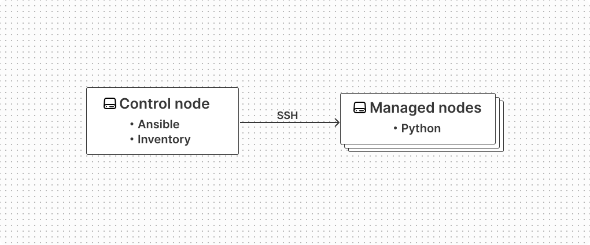

Ansible に入門したので、使い方をまとめる。

<!--truncate-->

## Ansible の概要

Ansible はシステムの管理を自動化するためのプログラム。

| 項目         | 情報                                                                                                                                                                                       |
| ------------ | ------------------------------------------------------------------------------------------------------------------------------------------------------------------------------------------ |
| 開発元       | Red Hat, Inc.                                                                                                                                                                              |
| 利用方法     | - [ソースコード](https://github.com/ansible/ansible)<br/>- [ansible パッケージ](https://pypi.org/project/ansible/)<br/>- [ansible-core パッケージ](https://pypi.org/project/ansible-core/) |
| ライセンス   | [GNU General Public License v3.0 or later](https://github.com/ansible/ansible/blob/devel/README.md#license)                                                                                |
| ドキュメント | [Ansible Documentation](https://docs.ansible.com/ansible/latest/index.html)                                                                                                                |

:::note
[https://docs.ansible.com/ansible/latest/getting_started/index.html](https://docs.ansible.com/ansible/latest/getting_started/index.html)

> Ansible automates the management of remote systems and controls their desired state.

:::

## Ansible のコンポーネント

Ansible は以下の 3 つのコンポーネントで構成される。

| コンポーネント | 概要                                          |
| -------------- | --------------------------------------------- |
| Control node   | Ansible がインストールされたノード            |
| Managed node   | Ansible を使って管理する対象のノード          |
| Inventory      | Control node が参照する Managed node のリスト |

Ansible を実行するには Control node で Ansible が提供する `ansible` コマンドもしくは `ansible-playbook` コマンドを実行する。これらは Ansible CLI と呼ばれる。

Ansible は Control node から SSH を使って Managed node に接続する。このため Managed node には Ansible のエージェントをインストールする必要がないが、Managed node には SSH で接続できる他に Python の実行環境が必要になる。これは Ansible が Control node で生成した Python のコードを Managed node 側で実行するため。



:::note

[https://docs.ansible.com/ansible/latest/getting_started/index.html](https://docs.ansible.com/ansible/latest/getting_started/index.html)

> Control node
> A system on which Ansible is installed. You run Ansible commands such as ansible or ansible-inventory on a control node.

> Inventory
> A list of managed nodes that are logically organized. You create an inventory on the control node to describe host deployments to Ansible.

> Managed node
> A remote system, or host, that Ansible controls.

:::

:::note
[https://docs.ansible.com/ansible/latest/installation_guide/intro_installation.html#installation-guide](https://docs.ansible.com/ansible/latest/installation_guide/intro_installation.html#installation-guide)

> Ansible is an agentless automation tool that you install on a single host (referred to as the control node).
> From the control node, Ansible can manage an entire fleet of machines and other devices (referred to as managed nodes) remotely with SSH, Powershell remoting, and numerous other transports, all from a simple command-line interface with no databases or daemons required.

> The managed node (the machine that Ansible is managing) does not require Ansible to be installed, but requires Python to run Ansible-generated Python code. The managed node also needs a user account that can connect through SSH to the node with an interactive POSIX shell.
> For your control node (the machine that runs Ansible), you can use nearly any UNIX-like machine with Python installed.

:::

## Ansible のインストール

Ansible には `ansible-core` と `ansible` の 2 つの Python パッケージがある。

- **ansible-core**  
  Ansible の実行環境と最小限の Module と Plugin ([Ansible.Builtin Collection](https://docs.ansible.com/ansible/latest/collections/ansible/builtin/index.html#plugins-in-ansible-builtin)) が含まれるパッケージ
- **ansible**  
  ansible-core パッケージの内容に加えて、コミュニティが選定した Module や Plugin が付属したパッケージ

どちらのパッケージも Control node で `pipx` か `pip` を使ってインストールできる。  
今回は `pipx` でインストールしてみた。

```bash
pipx install --include-deps ansible
```

以下で `ansible-playbook` コマンドがインストールされていることを確認できる。

```bash
ansible-playbook --version
```

:::note

[https://docs.ansible.com/ansible/latest/installation_guide/intro_installation.html#selecting-an-ansible-package-and-version-to-install](https://docs.ansible.com/ansible/latest/installation_guide/intro_installation.html#selecting-an-ansible-package-and-version-to-install)

> Ansible’s community packages are distributed in two ways:
> ansible-core: a minimalist language and runtime package containing a set of Ansible.Builtin.
> ansible: a much larger “batteries included” package, which adds a community-curated selection of Ansible Collections for automating a wide variety of devices.

:::

## Ansible の設定

`ansible.cfg` は Ansible の設定ファイル。INI 形式で記述する。  
以下の優先順位で読み込まれる。

1. 環境変数 `ANSIBLE_CONFIG` に設定したパス
2. カレントディレクトリ : `./ansible.cfg`
3. ユーザーのホームディレクトリ : `~/ansible.cfg`
4. `/etc/ansible/ansible.cfg`

`ansible.cfg` の設定項目は以下のドキュメントに記載されている。

- [https://docs.ansible.com/ansible/latest/reference_appendices/config.html](https://docs.ansible.com/ansible/latest/reference_appendices/config.html)

以下のコマンドで `ansible.cfg` の雛形を生成できる。  
`--disabled` を付けることで全ての設定がコメントアウトされた内容で出力される。

```bash
ansible-config init --disabled > ansible.cfg
```

よく利用する設定項目を列挙しておく。

| 項目              | 内容                                                                                                                                                                                                                                                                                            |
| ----------------- | ----------------------------------------------------------------------------------------------------------------------------------------------------------------------------------------------------------------------------------------------------------------------------------------------- |
| forks             | Managed node 上で Task を実行するために使用するプロセスの最大数を指定。デフォルト値は `5` 。                                                                                                                                                                                                    |
| log_path          | Ansible のログを書き込む Control node 上のファイルパスを指定。設定しなかった場合はログはどこにも書き込まれない。                                                                                                                                                                                |
| host_key_checking | Managed node に SSH で接続する際に公開鍵のフィンガープリントのチェックを行うかどうかを指定。デフォルト値は `True`。                                                                                                                                                                             |
| gathering         | Managed node の情報 (Fact) を収集するかどうかを指定。キャッシュを無視して常に情報収集が行われる `implicit`、明示的に指定しない限り情報収集を行わない `explicit`、新規に接続した時のみ情報収集を行い、キャッシュがある場合は情報収集を行わない `smart` が設定できる。デフォルト値は `implicit`。 |
| transport         | Managed host への接続方法を指定。Python の Paramiko package の SSH 機能を利用する `paramiko`、SSH を利用せずローカルホストに接続を行う `local`、OS と SSH のバージョンによって `ssh` と `paramiko` を切り替える `smart` (ただし DEPRECATED) の他、任意の Connection plugin が指定できる。       |

:::note
[https://docs.ansible.com/ansible/latest/reference_appendices/config.html#default-gathering](https://docs.ansible.com/ansible/latest/reference_appendices/config.html#default-gathering)

> DEFAULT_GATHERING
>
> - implicit : the cache plugin will be ignored and facts will be gathered per play unless ‘gather_facts: False’ is set.
> - explicit : facts will not be gathered unless directly requested in the play.
> - smart : each new host that has no facts discovered will be scanned, but if the same host is addressed in multiple plays it will not be contacted again in the run.

:::

:::note
[https://docs.ansible.com/ansible/latest/reference_appendices/config.html#default-transport](https://docs.ansible.com/ansible/latest/reference_appendices/config.html#default-transport)

> DEFAULT_TRANSPORT  
> Can be any connection plugin available to your ansible installation. There is also a (DEPRECATED) special ‘smart’ option, that will toggle between ‘ssh’ and ‘paramiko’ depending on controller OS and ssh versions.

:::

## Inventory の作成

Inventory は Managed node のリスト。
Inventory には Static inventory と Dynamic inventory がある。

### Static inventory

:::note

[https://docs.ansible.com/ansible/latest/inventory_guide/intro_inventory.html](https://docs.ansible.com/ansible/latest/inventory_guide/intro_inventory.html)

:::

Static inventory は INI 形式もしくは YAML 形式のファイル。
デフォルトの Static inventory は `/etc/ansible/hosts` に存在する。
ユーザーが任意のディレクトリにファイルを作成することもできる。

#### 基本の書式

- INI 形式の例

```ini
one.example.com
two.example.com

[webservers]
foo.example.com
bar.example.com

[dbservers]
alpha.example.com
beta.example.com
```

- YAML 形式の例

```yaml
---
ungrouped:
  hosts:
    one.example.com:
    two.example.com:
webservers:
  hosts:
    foo.example.com:
    bar.example.com:
dbservers:
  hosts:
    alpha.example.com:
    beta.example.com:
```

`one.example.com` や `two.example.com` が Managed node となるホスト。  
`webservers` や `dbservers` はホストをまとめるグループ。

#### ホストは複数のグループに所属できる

ホストは複数のグループに所属できる。  
例えば以下では `foo.example.com` は `webservers` と `prod` に所属している。

- INI 形式の例

```ini
[webservers]
foo.example.com  # foo.example.com は webservers に所属
bar.example.com

[dbservers]
one.example.com
two.example.com

[prod]
foo.example.com  # foo.example.com は prod に所属
one.example.com

[test]
bar.example.com
two.example.com
```

- YAML 形式の例

```yaml
---
webservers:
  hosts:
    foo.example.com: # foo.example.com は webservers に所属
    bar.example.com:
dbservers:
  hosts:
    one.example.com:
    two.example.com:
prod:
  hosts:
    foo.example.com: # foo.example.com は prod に所属
    one.example.com:
test:
  hosts:
    bar.example.com:
    two.example.com:
```

#### all グループと ungrouped グループ

Ansible は、ユーザーが定義したグループ以外にも以下のグループを作成する。

| グループ名  | 所属するホスト                             |
| ----------- | ------------------------------------------ |
| `all`       | 全てのホスト                               |
| `ungrouped` | `all` 以外のどのグループにも属さないホスト |

#### グループの親子関係

グループには親子関係を持たせることができる。

- INI 形式の例  
  INI 形式の場合は `:children` サフィックスで記述する。

```ini
[east]
foo.example.com
one.example.com

[west]
bar.example.com
two.example.com

[prod:children]  # east は prod の子グループ
east

[test:children]  # west は test の子グループ
west
```

- YAML 形式の例  
  YAML 形式の場合は `children:` エントリーで記述する。

```yaml
---
east:
  hosts:
    foo.example.com:
    one.example.com:
west:
  hosts:
    bar.example.com:
    two.example.com:
prod:
  children: # east は prod の子グループ
    east:
test:
  children: # west は test の子グループ
    west:
```

#### レンジを使ったホストの記載

Inventory はレンジを使った記載をサポートしている。

- INI 形式の例

```ini
[webservers]
www[01:50].example.com  # www01.example.com ~ www50.example.com
```

- YAML 形式の例

```yaml
---
webservers:
  hosts:
    www[01:50].example.com: # www01.example.com ~ www50.example.com
```

増加幅を指定することも可能。

- INI 形式の例

```ini
[webservers]
www[01:50:2].example.com  # www01.example.com, www03.example.com, ...
```

- YAML 形式の例

```yaml
---
webservers:
  hosts:
    www[01:50:2].example.com: # www01.example.com, www03.example.com, ...
```

アルファベットのレンジによる記載も可能。

- INI 形式の例

```ini
[webservers]
www-[a:f].example.com  # www-a.example.com ~ www-f.example.com
```

- YAML 形式の例

```yaml
webservers:
  hosts:
    www-[a:f].example.com: # www-a.example.com ~ www-f.example.com
```

#### ホスト変数

ホストに変数を定義することができる。

- INI 形式の例

```ini
[webservers]
host1 http_port=80 rate_limit=1000
host2 http_port=8080 rate_limit=100
```

- YAML 形式の例

```yaml
---
webservers:
  hosts:
    host1:
      http_port: 80
      rate_limit: 1000
    host2:
      http_port: 8080
      rate_limit: 100
```

変数は Ansible 実行時に処理の中で利用することができる他、Ansible が Managed node に接続する際の挙動を制御することもできる。いくつかこのための特別な変数をまとめておく。

| 変数名                       | 説明                                                                                                                                         |
| ---------------------------- | -------------------------------------------------------------------------------------------------------------------------------------------- |
| `ansible_host`               | Managed node のホスト名を指定する。ホストに FQDN や IP アドレスを記述しなくても、`ansible_host` を設定することでホストの接続先を指定できる。 |
| `ansible_port`               | Managed node に SSH で接続する際のポートを指定する。デフォルト値は `22`。                                                                    |
| `ansible_user`               | SSH で接続する際のユーザー名を指定する。デフォルト値は Ansible を実行したユーザー。                                                          |
| `ansible_password`           | SSH で接続する際のパスワードを指定する。                                                                                                     |
| `ansible_become`             | 特権実行を行うかどうかを指定する。デフォルト値は `false`。                                                                                   |
| `ansible_become_user`        | タスクを実行する特権ユーザーを指定する。                                                                                                     |
| `ansible_become_password`    | 特権ユーザーになるためのパスフレーズを設定する。                                                                                             |
| `ansible_python_interpreter` | Managed node の Python のパスを指定する。デフォルト値は `/usr/bin/python`。                                                                  |

#### グループ変数

グループにも変数を定義することができる。これはグループに含まれる全てのホストに対して変数を定義するのと同じ。

- INI 形式の例

```ini
[webservers]
host1
host2

[webservers:vars]
http_port=80
rate_limit=1000
```

- YAML 形式の例

```yaml
---
webservers:
  hosts:
    host1:
    host2:
  vars:
    http_port: 80
    rate_limit: 1000
```

#### 変数のファイル分割

Inventory にホスト変数を書く代わりに `host_vars/<ホスト名>.yml` もしくは `host_vars/<ホスト名>/<任意のファイル名>.yml` にホスト変数を記述することができる。  
また inventory にグループ変数を書く代わりに `group_vars/<グループ名>.yml` もしくは `group_vars/<グループ名>/<任意のファイル名>.yml` を作成してグループ変数を記述することができる。

以下のような inventory があった場合、

```yaml
---
webservers:
  hosts:
    host1:
      http_port: 80
      rate_limit: 1000
    host2:
      http_port: 8080
      rate_limit: 100
  vars:
    document_root: "/var/www/html"
```

以下のようにファイルを分割できる。

```
.
├── group_vars
│   └── webservers.yml
├── host_vars
│   ├── host1.yml
│   └── host2.yml
└── inventory.yml
```

- `host_vars/host1.yml`

```yaml
---
http_port: 80
rate_limit: 1000
```

- `host_vars/host2.yml`

```yaml
---
http_port: 8080
rate_limit: 100
```

- `group_vars/webservers.yml`

```yaml
---
document_root: "/var/www/html"
```

## ansible コマンドの実行

Ansible を実行するには Control node で Ansible が提供する `ansible` コマンドや `ansible-playbook` コマンドを実行する。
`ansible` コマンドは Inventory に記載したホストやグループに対して 1 つの操作を実行するのに対して、`ansible-playbook` コマンドは Playbook と呼ばれるファイルに記述された一連の操作を一度に実行する。ここではまず `ansible` コマンドを実行してみる。

### ansible コマンドの実行

`ansible` コマンドの実行には最低限以下のオプションが必要。

```bash
ansible -i <inventory> -m <module name> <host pattern>
```

`-i <inventory>` には Inventory のファイルパスを指定する。  
`<host pattern>` には Inventory に記載したホスト名もしくはグループ名のパターンを指定する。  
`-m <module name>` に Managed node 上で実行したい処理に応じた Ansible module を指定する。

例えば Control node から Managed node へログインが可能であることや Managed node に Python の実行環境が存在することの確認するために `ansible.builtin.ping` Module を利用することができる。

```bash
ansible -i hosts.yml control01.local -m ansible.builtin.ping

control01.local | SUCCESS => {
    "ansible_facts": {
        "discovered_interpreter_python": "/usr/bin/python3"
    },
    "changed": false,
    "ping": "pong"
}
```

### Ansible module の引数を指定する

Ansible module の中には引数を必要とするものがある。  
Ansible module に引数を渡すには `-a <module args>` を使用する。

```bash
ansible -i <inventory> -m <module name> -a <module args> <host pattern>
```

例えば Managed node 内にファイルを作成するために `ansible.builtin.file` Module を利用する場合、ファイルパスなどの情報は以下のように指定する。

```bash
ansible -i hosts.yml control01.local -m ansible.builtin.file -a 'path=/tmp/test.txt state=touch mode=0644'

control01.local | CHANGED => {
    "ansible_facts": {
        "discovered_interpreter_python": "/usr/bin/python3"
    },
    "changed": true,
    "dest": "/tmp/test.txt",
    "gid": 1001,
    "group": "ci",
    "mode": "0644",
    "owner": "ci",
    "secontext": "unconfined_u:object_r:user_tmp_t:s0",
    "size": 0,
    "state": "file",
    "uid": 1001
}
```

### Ansible module のドキュメントを確認する

Ansible module のドキュメントは以下のコマンドで確認できる。

```bash
ansible-doc <module name>
```

`ansible.builtin.ping` のドキュメントを確認する場合は以下のように実行する。

```bash
ansible-doc ansible.builtin.ping
```

### 複数の inventory を使用する

`ansible` コマンドに複数の `-i <inventory>` オプションを指定して複数の Inventory を読み込むことができる。

```bash
ansible -i east.yml -i west.yml *.com -m ansible.builtin.ping
```

また `ansible` コマンドの `-i <inventory>` オプションにディレクトリのパスを指定して、指定したディレクトリ内の全ての Inventory を読み込むこともできる。

```bash
ansible -i hosts/ *.com -m ansible.builtin.ping
```

:::warning

複数の Inventory をディレクトリで指定する場合は、ファイル名の ASCII オーダーで読み込まれるので、グループの親子関係を使っている場合はファイル名に通し番号を付けるなどして親グループが子グループより先に読み込まれてエラーにならないように注意が必要。

:::

## Playbook の作成

`ansible` コマンドでは 1 つの Ansible Module を実行していたが、複数の Module を実行したい場合は Playbook にそれらを記述して `ansible-playbook` コマンドを実行する。

Playbook は YAML 形式で記述する。  
Playbook は 1 つのファイルに全ての内容を記述する形式と、複数ファイルに分割して記述する形式がある。  
前者は小規模な構成では可読性が高いが、大規模な構成ではファイルが肥大化してしまう。  
いくつかのプレイブックの書き方をまとめておく。

### 1 つのファイルに Playbook を記述する形式

以下のように Playbook `main.yml` を配置する。

```
sample-playbook/
├── ansible.cfg
├── hosts.yml
└── main.yml
```

以下は `main.yml` の例。

```yaml
---
- name: Update web servers
  hosts: webservers
  tasks:
    - name: Ensure httpd is at the latest version
      ansible.builtin.yum:
        name: httpd
        state: latest

    - name: Write the httpd config file
      ansible.builtin.template:
        src: /srv/httpd.j2
        dest: /etc/httpd.conf

- name: Update db servers
  hosts: databases
  tasks:
    - name: Ensure postgresql is at the latest version
      ansible.builtin.yum:
        name: postgresql
        state: latest

    - name: Ensure that postgresql is started
      ansible.builtin.service:
        name: postgresql
        state: started
```

`main.yml` の構造は以下のようになっている。  
まず Playbook は 1 つ以上の Play のリストとして記述する。

```yaml
---
- <play>
- <play>
# ...
```

`<play>` は Inventory に記述したホストもしくはグループのパターンと、1 つ以上の Task のリストを含む。

```yaml
name: <play name>
hosts: <host pattern>
tasks:
  - <task>
```

`<task>` には Ansible module 名と、使用する Ansible module に必要な引数を記述する。

```yaml
name: <task name>
<module name>:
  <arg key>: <value>
  <arg key>: <value>
  # ...
```

### 複数ファイルに分割して記述する形式 1

以下のように各ファイルを配置する。

```
sample-playbook
├── ansible.cfg
├── hosts.yml
├── roles
│   └── web_server
│       ├── defaults
│       │   └── main.yml
│       ├── files
│       |   └── status_check.html
│       ├── handlers
│       │   └── main.yml
│       ├── meta
│       │   └── main.yml
│       ├── tasks
│       │   └── main.yml
│       ├── templates
│       └── vars
│           └── main.yml
└── site.yml
```

なお `roles` ディレクトリ配下のディレクトリとファイルは以下のコマンドで自動的に雛形を生成できる。

```bash
ansible-galaxy init roles/<role name>
```

上記の `roles/webservers` ディレクトリを作成するには以下のように実行する。

```bash
ansible-galaxy init roles/webservers
```

#### defaults ディレクトリ

Role 内で使用する変数のデフォルト値が記述されたファイルを配置するディレクトリ。  
Role が読み込まれると、自動的に変数のデフォルト値として `main.yml` の内容が読み込まれる。

以下は `main.yml` の例。

```yaml
---
httpd_bind_address: "{{ ansible_host }}"
httpd_bind_port: 80
httpd_conf_dir: "/etc/httpd/conf"
httpd_doc_root: "/var/www/html"
httpd_pkg: "httpd"
httpd_service: "httpd.service"
```

#### files ディレクトリ

`ansible.builtin.copy` などの Ansible module で Managed node に転送するファイルを配置するディレクトリ。

#### tasks ディレクトリ

Playbook の `tasks` セクションの内容を定義した YAML ファイルを配置するディレクトリ。  
Playbook から Role が読み込まれると、自動的に `tasks` セクションの内容として `main.yml` が読み込まれる。

以下は `main.yml` の例。

```yaml
---
- name: Install httpd package
  ansible.builtin.dnf:
    name: "{{ httpd_pkg }}"
    state: installed

- name: Copy httpd.conf
  ansible.builtin.template:
    src: httpd.conf.j2
    dest: "{{ httpd_conf_dir }}/httpd.conf"
  notify:
    - restart httpd

- name: Copy status_check.html
  ansible.builtin.copy:
    src: status_check.html
    dest: "{{ httpd_doc_root }}/"
  notify:
    - restart httpd

- name: Allow http service
  ansible.builtin.firewalld:
    service: http
    permanent: yes
    state: enabled
  notify:
    - reload firewalld
```

#### handlers ディレクトリ

Playbook の `handler` セクションの内容を定義した YAML ファイルを配置するディレクトリ。  
`handler` セクションでは `tasks` セクションの `notify` ディレクティブで記載される Task を実装する。

以下は `main.yml` の例。

```yaml
---
- name: restart httpd
  ansible.builtin.systemd:
    name: "{{ httpd_service }}"
    state: restarted

- name: reload firewalld
  ansible.builtin.systemd:
    name: firewalld
    state: reloaded
```

#### templates ディレクトリ

`ansible.builtin.template` Module で利用する Jinja2 形式のテンプレートを配置するディレクトリ。  
以下は `httpd.conf.j2` の例。

```ini
ServerRoot "/etc/httpd"

Listen {{ httpd_bind_address }}:{{ httpd_bind_port }}

Include conf.modules.d/*.conf

User apache
Group apache

<Directory />
    AllowOverride none
    Require all denied
</Directory>

DocumentRoot "/var/www/html"

<Directory "/var/www">
    AllowOverride None
    Require all granted
</Directory>

<Directory "/var/www/html">
    Options Indexes FollowSymLinks
    AllowOverride None
    Require all granted
</Directory>

<IfModule dir_module>
    DirectoryIndex index.html
</IfModule>

<Files ".ht*">
    Require all denied
</Files>

ErrorLog "logs/error_log"
LogLevel warn

<IfModule log_config_module>
    LogFormat "%h %l %u %t \"%r\" %>s %b \"%{Referer}i\" \"%{User-Agent}i\"" combined
    LogFormat "%h %l %u %t \"%r\" %>s %b" common

    <IfModule logio_module>
      LogFormat "%h %l %u %t \"%r\" %>s %b \"%{Referer}i\" \"%{User-Agent}i\" %I %O" combinedio
    </IfModule>

    CustomLog "logs/access_log" combined
</IfModule>

<IfModule alias_module>
    ScriptAlias /cgi-bin/ "/var/www/cgi-bin/"
</IfModule>

<Directory "/var/www/cgi-bin">
    AllowOverride None
    Options None
    Require all granted
</Directory>

<IfModule mime_module>
    TypesConfig /etc/mime.types
    AddType application/x-compress .Z
    AddType application/x-gzip .gz .tgz
    AddType text/html .shtml
    AddOutputFilter INCLUDES .shtml
</IfModule>

AddDefaultCharset UTF-8

<IfModule mime_magic_module>
    MIMEMagicFile conf/magic
</IfModule>


EnableSendfile on

IncludeOptional conf.d/*.conf
```

#### vars ディレクトリ

Role 内で使用する変数の値が記述されたファイルを配置するディレクトリ。  
Playbook から Role が読み込まれると、自動的に `main.yml` に記載された変数の値が読み込まれる。  
書式は `defaults/main.yml` と同様。

#### meta ディレクトリ

Role の依存関係などを定義した YAML ファイルを配置するディレクトリ。

#### site.yml

Role を読み込む Playbook の大元のファイル。  
ファイル名は何でも良い。

以下は `site.yml` の例。  
`roles` ディレクティブで Role を読み込む。

```yaml
---
- name: Configure Web Server
  hosts: web_servers
  become: true
  roles:
    - web_server
```

### 複数ファイルに分割して記述する形式 2

以下のように各ファイルを配置する。

```
.
├── ansible.cfg
├── hosts.yml
├── roles
│   └── web_server
│       ├── defaults
│       │   └── main.yml
│       ├── files
│       │   └── status_check.html
│       ├── handlers
│       │   └── main.yml
│       ├── tasks
│       │   ├── configure.yml
│       │   └── install.yml
│       ├── templates
│       │   └── httpd.conf.j2
│       └── vars
│           └── main.yml
└── site.yml
```

前述の Playbook とほとんど同じ構造だが、`tasks` ディレクトリの中に `main.yml` が存在せず、代わりに `install.yml` と `configure.yml` がある点が異なる。

#### tasks ディレクトリ

tasks ディレクトリにはある程度まとまった処理の単位で `main.yml` に記載していた内容を分割した `install.yml` と `configure.yml` を配置している。

以下は `install.yml` の例。

```yaml
---
- name: Install httpd package
  ansible.builtin.dnf:
    name: "{{ httpd_pkg }}"
    state: installed
```

以下は `configure.yml` の例。

```yaml
---
- name: Copy httpd.conf
  template:
    src: httpd.conf.j2
    dest: "{{ httpd_conf_dir }}/httpd.conf"
  notify:
    - restart httpd

- name: Copy status_check.html
  copy:
    src: status_check.html
    dest: "{{ httpd_doc_root }}/"
  notify:
    - restart httpd

- name: Allow http service
  firewalld:
    service: http
    permanent: yes
    state: enabled
  notify:
    - reload firewalld
```

#### site.yml

`site.yml` では `roles` で Role 名を指定する代わりに `ansible.builtin.include_role` Module を利用して Role 内の Task を読み込む。

以下は `site.yml` の例。

```yaml
---
- name: Configure Web Server
  hosts: web_servers
  become: true
  tasks:
    - name: Install httpd package
      ansible.builtin.include_role:
        name: web_server
        tasks_from: install
    - name: Configure httpd
      ansible.builtin.include_role:
        name: web_server
        tasks_from: configure
```

このようにすることで role 内の処理を細かく Playbook から呼び出すことができる。

## Playbook の実行

`ansible-playbook` コマンドで Playbook を実行する。  
最低限以下のオプションが必要。

```bash
ansible-playbook -i <inventory> <playbook>
```

前述の sample-playbook を実行する場合は以下のように実行する。

```bash
ansible-playbook -i hosts.yml site.yml --ask-become-pass

SSH password:
BECOME password[defaults to SSH password]:

PLAY [Configure Web Server] *******************************************************************

TASK [Gathering Facts] ************************************************************************
ok: [control01.local]

TASK [web_server : Install httpd package] *****************************************************
changed: [control01.local]

TASK [web_server : Copy httpd.conf] ***********************************************************
changed: [control01.local]

TASK [web_server : Copy status_check.html] ****************************************************
changed: [control01.local]

TASK [web_server : Allow http service] ********************************************************
ok: [control01.local]

RUNNING HANDLER [web_server : restart httpd] **************************************************
changed: [control01.local]

PLAY RECAP ************************************************************************************
control01.local            : ok=6    changed=4    unreachable=0    failed=0    skipped=0    rescued=0    ignored=0
```

`PLAY RECAP` には Playbook を実行した最終的な結果が出力される。各項目の意味は以下。

| 結果        | 意味                                                                |
| ----------- | ------------------------------------------------------------------- |
| ok          | 既に期待された状態になっていたため、処理を行わなかった。            |
| changed     | 処理を行い、期待された状態になった。                                |
| unreachable | managed node に接続できなかった。                                   |
| failed      | task を実行した結果、エラーが発生し、期待された状態にならなかった。 |
| skipped     | task の実行条件に当てはまらなかったため、処理を行わなかった。       |

## セキュリティのための仕組み

### 変数の暗号化

`ansible_password` や `ansible_become_password` のような変数の値を平文で記述するのはセキュリティ上よろしくない。`ansible-vault` コマンドを利用すると、変数の値を暗号化できる。

以下のように変数の値を暗号化する。

```bash
$ echo 'some password' | ansible-vault encrypt_string

New Vault password:
Confirm New Vault password:
Reading plaintext input from stdin. (ctrl-d to end input, twice if your content does not already have a newline)
Encryption successful
!vault |
          $ANSIBLE_VAULT;1.1;AES256
          66623038613361646564346434653434656438343563666664633166386538386133356261616162
          6431336334356463356230383933303663343530643563350a306665303335363131646334616538
          37373137613633633035333532386564373233346464613139336530313064666532346263333566
          6366666234356139610a373762376537343839356638626438326632303436616639613334366530
          6330
```

コマンドの実行結果として出力された文字列をそのまま変数の値として YAML ファイルに記述する。

```yaml
ansible_password: !vault |
  $ANSIBLE_VAULT;1.1;AES256
  66623038613361646564346434653434656438343563666664633166386538386133356261616162
  6431336334356463356230383933303663343530643563350a306665303335363131646334616538
  37373137613633633035333532386564373233346464613139336530313064666532346263333566
  6366666234356139610a373762376537343839356638626438326632303436616639613334366530
  6330
```

`ansible-playbook` コマンドを実行する際には `--ask-vault-pass` オプションもしくは `--vault-password-file <file path>` オプションを使用する。

```bash
ansible-playbook -i site.yml --ask-vault-pass
```

複数の変数の値を異なるパスワードで暗号化する場合には、それぞれの暗号化時に Vault ID を指定する。これは暗号化されたデータとパスワードを対応づけるための識別子。

```bash
$ echo 'some password' | ansible-vault encrypt_string --new-vault-id=<vault id>
```

復号するときは以下のようにコマンドを実行する。

```bash
ansible-playbook -i inventory site.yml --vault-id <vault id1>@prompt --vault-id <vault id2>@prompt
```

### ログの出力の回避

`ansible-playbook` コマンドを実行時に `-v` オプションを付けると標準出力に Task の詳細な情報が表示される。暗号化した変数を Task で利用する場合は `no_log` ディレクティブを利用して、標準出力に変数の値が表示されないようにする。

```yaml
- name: Some Secure Task
  ansible.builtin.debug:
    msg: "Secret value is {{ secret_value }}"
  no_log: true
```

## 参考

- Ansible 実践ガイド第 3 版
