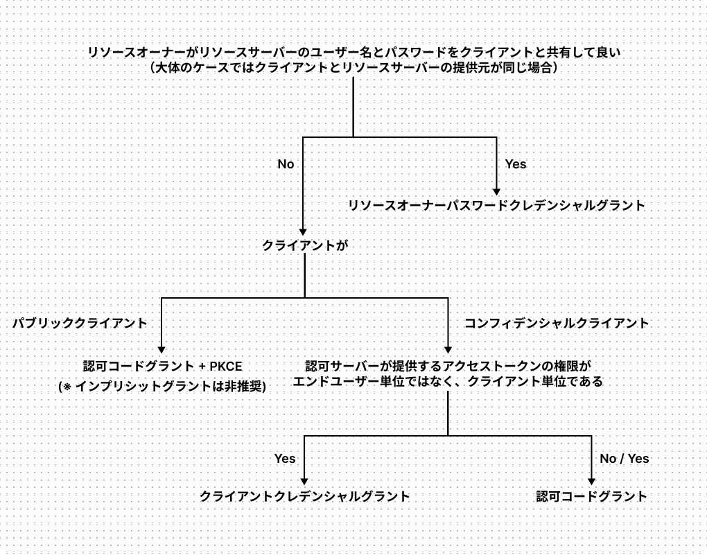
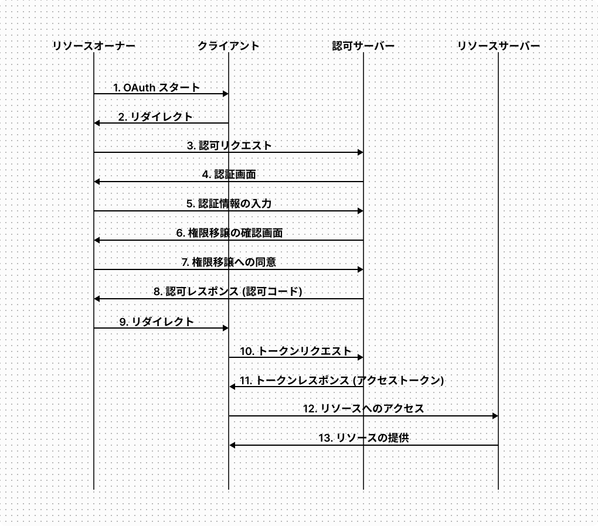
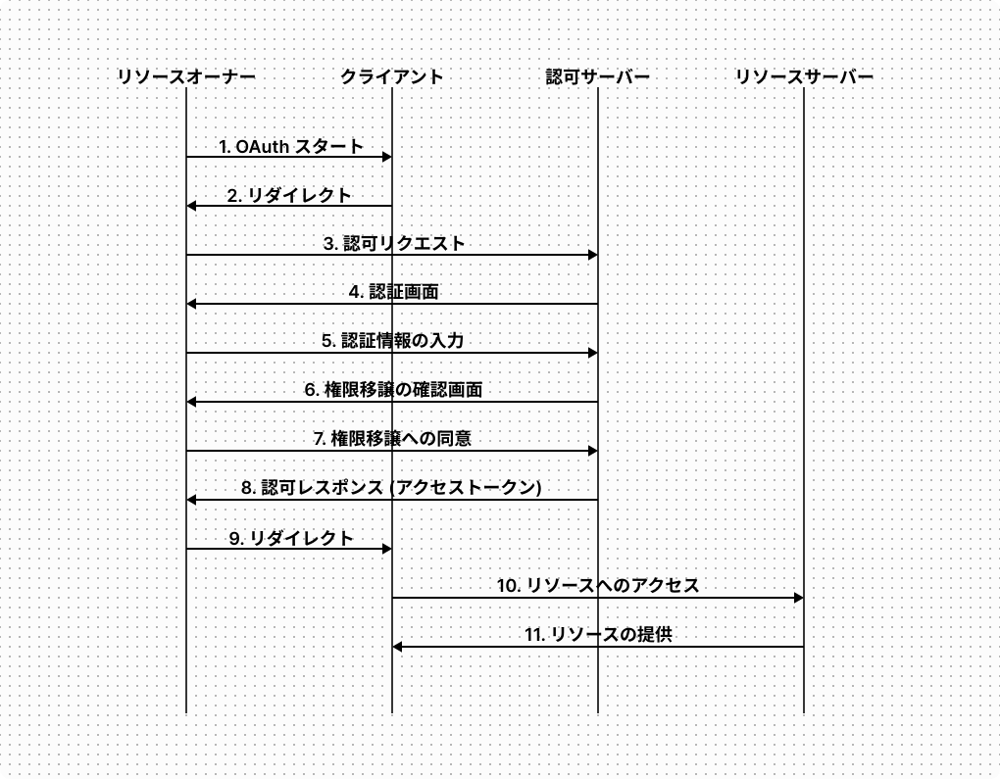
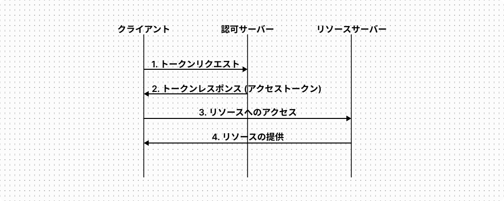
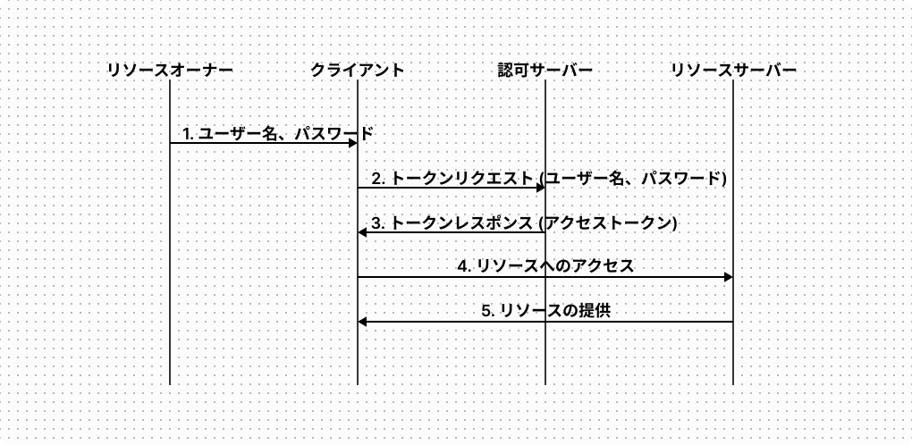
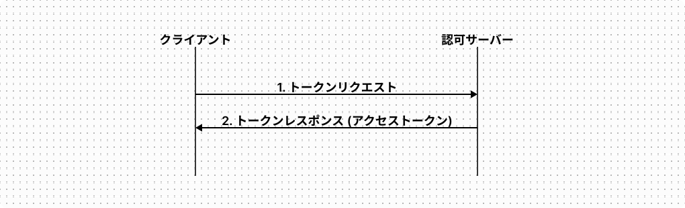

OAuth 2.0 に入門したので、仕様をまとめる。

<!--truncate-->

## OAuth 2.0 とは

OAuth 2.0 は HTTP サービスに対する限定的なアクセスをサードパーティアプリケーションに対して可能にする認可フレームワークである。

:::note
[https://datatracker.ietf.org/doc/html/rfc6749](https://datatracker.ietf.org/doc/html/rfc6749)

> The OAuth 2.0 authorization framework enables a third-party application to obtain limited access to an HTTP service

:::

## OAuth 2.0 のロール

OAuth2.0 には以下のロールが存在する。

### リソースサーバー

OAuth 2.0 によって限定的なアクセスが許可されるアクセス先の HTTP サービス。

### リソースオーナー

リソースサーバー内のリソースの所有者。

### クライアント

OAuth 2.0 によってリソースサーバーへの限定的なアクセスが許可されるアプリケーション。

OAuth 2.0 の認証情報であるクライアント ID とクライアントシークレットをセキュアに保存できるクライアントを「コンフィデンシャルクライアント」、セキュアに保存できないクライアントを「パブリッククライアント」と呼ぶ。

### 認可サーバー

クライアントに対してアクセストークンを発行するサーバー。

## OAuth 2.0 のグラントタイプ

OAuth 2.0 のグラントタイプとは、クライアントに権限付与を行う方法のこと。

OAuth 2.0 にはグラントタイプが４つ存在する。

- 認可コードグラント
- インプリシットグラント (非推奨)
- クライアントクレデンシャルグラント
- リソースオーナーパスワードクレデンシャルグラント

これら４つのグラントタイプはそれぞれ異なる通信フローによってクライアントに権限付与を行う。

### グラントタイプの選定方法

グラントタイプは以下のロジックで選定できる。



ただし上記のロジックで当てはまらなくても、認可コードグラント + PKCE は利用しても問題ない。

グラントタイプを単純な順に並べると以下。

1. クライアントクレデンシャルグラント
2. リソースオーナーパスワードクレデンシャルグラント
3. インププリシットグラント
4. 認可コードグラント

### 認可コードグラント

認可コードグラントは以下の流れで実行される。



#### 0. クライアントの登録

リソースを提供する組織に対してクライアントの情報を登録する。クライアントを登録すると、クライアント ID とクライアントシークレットが発行される。  
Google Cloud の場合、以下の情報の入力を求められた。

| 項目                       | 説明                                                                                          |
| -------------------------- | --------------------------------------------------------------------------------------------- |
| クライアントの種類         | 値を選択することで、以降の設定項目が変わる。今回は「ウェブ アプリケーション」を選択。         |
| 名前                       | クライアントの名前。Google Cloud のコンソール上でクライアントを識別するためにのみ使用される。 |
| 承認済みのリダイレクト URI | 認可の完了後にリダイレクトしたいクライアントの URI を設定する。                               |

#### 1. OAuth スタート

リソースオーナーがクライアントに対して OAuth のスタートをトリガーする。例えばクライアントがカレンダーアプリだった場合、「Google Calender と連携する」ボタンを押す操作がこれに該当する。

#### 2. リダイレクト

クライアントによって認可サーバーの認可エンドポイントにリダイレクトされる。例えば Google の認可エンドポイントは以下にある。

- https://accounts.google.com/o/oauth2/v2/auth

#### 3. 認可リクエスト

認可エンドポイントに認可リクエストを送信する。

```
GET /o/oauth2/v2/auth
  ?response_type=code
  &client_id=<client_id>
  &state=<state>
  &scope=<scope>
  &redirect_uri=<redirect_uri> HTTP/1.1
Host: accounts.google.com
```

各クエリパラメーターには以下の値を指定する。

| 項目          | 値                                                                                                                                              |
| ------------- | ----------------------------------------------------------------------------------------------------------------------------------------------- |
| response_type | 「code」を指定。この値によってクライアントが認可サーバーに対して認可コードの発行を求めていることを知らせる。このパラメーターは必須 (REQUIRED)。 |
| client_id     | クライアントを登録した際に発行されたクライアント ID を指定。このパラメーターは必須 (REQUIRED)。                                                 |
| state         | １文字以上の 0x20 ~ 0x7e からなるクライアントが生成したランダムな値を設定。用途は後述。このパラメーターは推奨 (RECOMMENDED)。                   |
| scope         | クライアントが要求するスコープを指定。このパラメーターは任意 (OPTIONAL)。                                                                       |
| redirect_uri  | クライアントを登録した際に指定したリダイレクト URI を指定。このパラメーターは任意 (OPTIONAL)。                                                  |

##### スコープとは

どんな権限を許可するかを制御する仕組み。あるリソースの読み込み / 書き込みなど、それぞれの権限に対応するスコープを指定する。

#### 4. 認証画面、 5. 認証情報の入力

認可サーバーがリソースオーナーを認証する。  
認証の方法は OAuth 2.0 の仕様では規定されておらず、ユーザー名とパスワードの入力、二要素認証、生体認証などを利用してよい。リソースオーナーが既に認可サーバーの提供するサービスでログイン済みの場合はこの処理は省略され得る。

認証が完了すると権限移譲の確認画面が認可サーバーからリソースオーナーに送信される。

#### 6. 権限移譲の確認画面、7. 権限移譲への同意

クライアントがスコープとして指定した権限を確認画面に表示し、リソースオーナーに対してクライアントに権限を移譲することへの同意の判断を求める。

リソースオーナーが同意する旨の操作をすることで、これを知らせるためのリクエストがリソースオーナーから認可サーバーに送信される。

#### 8. 認可レスポンス (認可コード)、9. リダイレクト

認可サーバーが事前に登録されたリダイレクト URI 向けの 302 レスポンスを返す。

```
HTTP/1.1 302 Found
Location: <redirect_uri>?code=<authorization_code>&state=<state>
```

リダイレクト URI には以下のクエリパラメーターが含まれている。

| 項目  | 値                                                                                                                                               |
| ----- | ------------------------------------------------------------------------------------------------------------------------------------------------ |
| code  | 認証コード。後続の処理でアクセストークンと交換するために使用する。                                                                               |
| state | 認可リクエスト送信時にクライアントで生成した state。認可リクエストに state パラメーターが含まれている場合は、このパラメーターは必須 (REQUIRED)。 |

認可コードは漏洩するリスクを和らげるために発行後の有効期限を短くする必要がある (MUST)。仕様では 10 分以内が推奨 (RECOMMENDED)。

:::note

RFC6749 - 4.1.2. Authorization Response

> The authorization code MUST expire shortly after it is issued to mitigate the risk of leaks. A maximum authorization code lifetime of 10 minutes is RECOMMENDED.

:::

レスポンスを受け取ったリソースオーナーは Location ヘッダーに指定されたリダイレクト URI を使ってクライアントにリクエストを送信する。リクエストを受け取ったクライアントは state の値が元々認可リクエストに付与した値と一致することを確認する。これはクロスサイトリクエストフォージェリー (CSRF) を防ぐため。

#### 10. トークンリクエスト

アクセストークンを取得するために、クライアントから認可サーバーのトークンエンドポイントにリクエストを送信する。例えば Google のトークンエンドポイントは以下にある。

- https://oauth2.googleapis.com/token

```
POST /token HTTP/1.1
Host: oauth2.googleapis.com
Authorization: Basic <base64 encoded "<client_id>:<client_secret>">
Content-Type: application/x-www-form-urlencoded

grant_type=authorization_code
&code=<authorization_code>
&redirect_uri=<redirect_uri>
```

リクエストには以下のパラメーターが含まれている。

| 項目          | 値                                                                                                                                                            |
| ------------- | ------------------------------------------------------------------------------------------------------------------------------------------------------------- |
| grant_type    | 「code」を指定。この値でクライアントが認可コードグラントを使用していることを認可サーバーに通知する。このパラメーターは必須 (REQUIRED)。                       |
| code          | 認可コード。認可サーバーはこの認可コードに紐づいた認可リクエストで要求されたスコープに対応するアクセストークンを発行する。このパラメーターは必須 (REQUIRED)。 |
| redirect_uri  | クライアントを登録した際に指定したリダイレクト URI を指定。認可リクエストに redirect_uri パラメーターが含まれている場合、このパラメーターは必須 (REQUIRED)。  |
| client_id     | クライアント ID を指定。                                                                                                                                      |
| client_secret | クライアントシークレットを指定。                                                                                                                              |

認可サーバーはクライアントが Authorization ヘッダーを使用せずに、リクエストボディにクライアント ID とクライアントシークレットを含めることをサポートしてもよい (MAY)。

:::note

RFC6649 - 2.3.1. Client Password

> the authorization server MAY support including the client credentials in the request-body

:::

```
POST /token HTTP/1.1
Host: oauth2.googleapis.com
Content-Type: application/x-www-form-urlencoded

grant_type=authorization_code
&code=<authorization_code>
&redirect_uri=<redirect_uri>
&client_id=<client_id>         # client_id をボディに記述
&client_secret=<client_secet>  # client_secret をボディに記述
```

Authorization ヘッダーを使用しない場合、クライアントは client_secret パラメーターを含めなくても良い場合がある。これはパブリッククライアントで認可コードグラントを使用する場合に、クライアントに保持されたクライアントシークレットがリバースエンジニアリングによって漏洩するのを防ぐことを考慮しているため。

#### 11. トークンレスポンス (アクセストークン)

認可サーバーがアクセストークンとその有効期限、リフレッシュトークンを含むレスポンスをクライアントに返却する。

```
HTTP/1.1 200 OK
Content-Type: application/json;charset=UTF-8
Cache-Control: no-store
Pragma: no-cache

{
  "access_token": <access_token>,
  "token_type": "Bearer",
  "expires_in": <expiration_time (seconds)>,
  "refresh_token": <refresh_token>,
}
```

レスポンスボディには以下のパラメーターが含まれる。

| 項目          | 値                                                                                                       |
| ------------- | -------------------------------------------------------------------------------------------------------- |
| access_token  | アクセストークン。クライアントはリソースサーバーへのリクエストにこのトークンを含める必要がある。         |
| token_type    | 「Bearer」。これはアクセストークンが Bearer トークンであることを示す。                                   |
| expires_in    | アクセストークンの refresh_token 有効期限が秒単位で記述されている。                                      |
| refresh_token | リフレッシュトークン。クライアントがアクセストークンの再発行を要求するリクエストにこのトークンを含める。 |

#### 12. リソースへのアクセス、13. リソースの提供

クライアントがリソースサーバーにリソースを要求する。この時、リクエストには以下のヘッダーを含める必要がある。

```
Authorization: Bearer <access_token>
```

### 認可コードグラント + PKCE

前述の認可コードグラントのリクエストとレスポンスに幾つかのパラメーターを追加することで、OAuth 2.0 の拡張仕様である PKCE (Proof Key for Code Exchange) (ピクシー) を実装できる。

PKCE によって認可サーバーは認可リクエストを送信したクライアントとトークンリクエストを送信したクライアントが同一であることを検証することができ、これによって発行された認可コードの横取りを防ぐことができる。

以降では認可コードグラントの処理のうち PKCE を実装する場合に変更が発生するものをまとめる。

#### 3. 認可リクエスト

認可コードを取得するため、クライアントが認可エンドポイントに認可リクエストを送信する。

```
GET /o/oauth2/v2/auth
  ?response_type=code
  &client_id=<client_id>
  &state=<state>&scope=<scope>
  &redirect_uri=<redirect_uri>
  &code_challenge=<code_challenge>
  &code_challenge_method=<code_challange_method> HTTP/1.1
Host: accounts.google.com
```

PKCE を実装する場合、以下の追加のパラメーターが必要になる。

| 項目                  | 値                                                                                                                                                                                                                                                                                                   |
| --------------------- | ---------------------------------------------------------------------------------------------------------------------------------------------------------------------------------------------------------------------------------------------------------------------------------------------------- |
| code_challenge_method | 「plain」もしくは「S256」を指定。                                                                                                                                                                                                                                                                    |
| code_challenge        | 43 ~ 128 文字の A-Z / a-z / 0-9 / “-” / “.” / “\_” / “~” から成るランダム文字列を code_verifier とし、code_challenge_method が「plain」の場合は code_verifier の値を指定。<br/> code_challenge_method が「S256」の場合は code_verifier の SHA256 ハッシュを BASE64URL エンコーディングした値を指定。 |

これらのパラメーター付きの認可リクエストを受け取った認可サーバーは code_challenge_method と code_challenge の値を保存しておく。

#### 10. トークンリクエスト

アクセストークンを取得するために、クライアントが認可サーバーのトークンエンドポイントにリクエストを送信する。

```
POST /token HTTP/1.1
Host: oauth2.googleapis.com
Content-Type: application/x-www-form-urlencoded

grant_type=authorization_code
&code=<authorization_code>
&redirect_uri=<redirect_uri>
&client_id=<client_id>
&code_verifier=<code_verifier>
```

PKCE を実装する場合、以下の追加のパラメーターが必要になる。

| 項目          | 値                                                               |
| ------------- | ---------------------------------------------------------------- |
| code_verifier | 認可リクエストに付与した code_challenge に使用した code_verifier |

code_verifier パラメーター付きのトークンリクエストを受け取った認可サーバーは code_verifier の値と保存されている code_challenge_method の値を使用して code_challenge の値を計算し、認可リクエストに付与されていた値と一致することを確認する。

これによって認可サーバーは認可リクエストを送信したクライアントとトークンリクエストを送信したクライアントが同一であることを検証することができる。

### インプリシットグラント (非推奨)

インプリシットグラントは以下の流れで実行される。



以降では認可コードグラントと同じメッセージは省いて、インプリシットグラントで違いがある箇所のみまとめる。

#### 3. 認可リクエスト

認可エンドポイントに認可リクエストを送信する。

```
GET /o/oauth2/v2/auth
  ?response_type=token
  &client_id=<client_id>
  &state=<state>
  &scope=<scope>
  &redirect_uri=<redirect_uri> HTTP/1.1
Host: accounts.google.com
```

認可コードグラントとの違いは response_type パラメーターの値が「code」ではなく「token」である点のみ。この値によってクライアントが認可サーバーに対してアクセストークンの発行を求めていることを知らせる。

#### 8. 認可レスポンス (アクセストークン)

認可サーバーが事前に登録されたリダイレクト URI 向けの 302 レスポンスを返す。

```
HTTP/1.1 302 Found
Location: <redirect_uri>
  #access_token=<access_token>
  &token_type=bearer
  &scope=<scope>
  &state=<state>
  &expires_in=<expiration_time (seconds)>
```

リダイレクト URI には認可コードグラントの認可レスポンスにはあった code パラメーターがなくなり、代わりに scope パラメーター、さらに認可コードグラントのトークンレスポンスに含まれていた access_token、token_type、expires_in パラメーターが含まれている。

また、クエリ「?」ではなくフラグメント「#」であることに注意。これはリダイレクト先にリクエストを送信する際にフラグメントは送信されないため、アクセストークンがリダイレクト先に渡らず、リダイレクト先のウェブサーバーでアクセストークンが流出することを防ぐことができる。

なお、インプリシットグラントではリフレッシュトークンは発行されない。

### クライアントクレデンシャルグラント

クライアントクレデンシャルグラントは以下の流れで実行される。



クライアントクレデンシャルグラントの利用条件は認可サーバーが発行するアクセストークンの権限がエンドユーザー単位ではなくクライアント単位であること。このことからエンドユーザーの認証や権限移譲の同意は必要なく、これにより処理の流れもシンプルになっている。

#### 1. トークンリクエスト

アクセストークンを取得するために、クライアントから認可サーバーのトークンエンドポイントにリクエストを送信する。

```
POST /token HTTP/1.1
Host: oauth2.googleapis.com
Authorization: Basic <base64 encoded "<client_id>:<client_secret>">
Content-Type: application/x-www-form-urlencoded

grant_type=client_credentials
&scope=<scope>
```

grant_type パラメーターに「client_credentials」を指定することで、認可サーバーにクライアントクレデンシャルグラントを使ってアクセストークンを要求していることを知らせる。

#### 2. トークンレスポンス (アクセストークン)

認可サーバーがアクセストークンとその有効期限を含むレスポンスをクライアントに返却する。

```
HTTP/1.1 200 OK
Content-Type: application/json;charset=UTF-8
Cache-Control: no-store
Pragma: no-cache

{
  "access_token": <access_token>,
  "token_type": "Bearer",
  "expires_in": <expiration_time (seconds)>,
}
```

クライアントクレデンシャルグラントでは、トークンレスポンスにリフレッシュトークンは含めるべきではない (SHOULD NOT)。

:::note

RFC6759 - 4.4.3. Access Token Response

> A refresh token SHOULD NOT be included.

:::

### リソースオーナーパスワードクレデンシャルグラント

リソースオーナーパスワードクレデンシャルグラントは以下の流れで実行される。



リソースオーナーパスワードクレデンシャルグラントの利用条件はリソースオーナーがリソースサーバーのユーザー名とパスワードをクライアントと共有して良い場合であること。このことから、リソースオーナーはクライアントに対してユーザー名とパスワードを渡し、クライアントはこの情報を使ってアクセストークンを要求する。

なお、リソースオーナーパスワードクレデンシャルグラントではクライアントの登録が行われることはほぼ無い。

#### 2. トークンリクエスト (ユーザー名、パスワード)

アクセストークンを取得するために、クライアントから認可サーバーのトークンエンドポイントにリクエストを送信する。

```
POST /token HTTP/1.1
Host: oauth2.googleapis.com
Authorization: Basic <base64 encoded "<client_id>:<client_secret>">
Content-Type: application/x-www-form-urlencoded

grant_type=password
&username=<username>
&password=<password>
&scope=<scope>
```

grant_type パラメーターに「password」を指定することで、認可サーバーにリソースオーナーパスワードクレデンシャルグラントを使ってアクセストークンを要求していることを知らせる。

#### 3. トークンレスポンス (アクセストークン)

認可サーバーがアクセストークンとその有効期限、リフレッシュトークンを含むレスポンスをクライアントに返却する。

```
HTTP/1.1 200 OK
Content-Type: application/json;charset=UTF-8
Cache-Control: no-store
Pragma: no-cache

{
  "access_token": <access_token>,
  "token_type": "Bearer",
  "expires_in": <expiration_time (seconds)>,
  "refresh_token": <refresh_token>,
}
```

## アクセストークンの再発行

アクセストークンが失効した際、リフレッシュトークンがあればクライアントはアクセストークンの再発行をリクエストすることができる。

アクセストークンの再発行は以下の流れで実行される。



### 1. トークンリクエスト

クライアントはリフレッシュトークンを使って認可サーバーにアクセストークンの発行をリクエストする。

```
POST /token HTTP/1.1
Host: oauth2.googleapis.com
Authorization: Basic <base64 encoded "<client_id>:<client_secret>">
Content-Type: application/x-www-form-urlencoded

grant_type=refresh_token
&refresh_token=<refresh_token>
```

### 2. トークンレスポンス

認可サーバーがアクセストークンとその有効期限、リフレッシュトークンを含むレスポンスをクライアントに返却する。

```
HTTP/1.1 200 OK
Content-Type: application/json;charset=UTF-8
Cache-Control: no-store
Pragma: no-cache

{
  "access_token": <access_token>,
  "token_type": "Bearer",
  "expires_in": <expiration_time (seconds)>,
  "refresh_token": <refresh_token>,
}
```

## 参考

- [雰囲気で OAuth2.0 を使っているエンジニアが OAuth2.0 を整理して、手を動かしながら学べる本](https://booth.pm/ja/items/1296585)
- [RFC6749 The OAuth 2.0 Authorization Framework](https://datatracker.ietf.org/doc/html/rfc6749)
