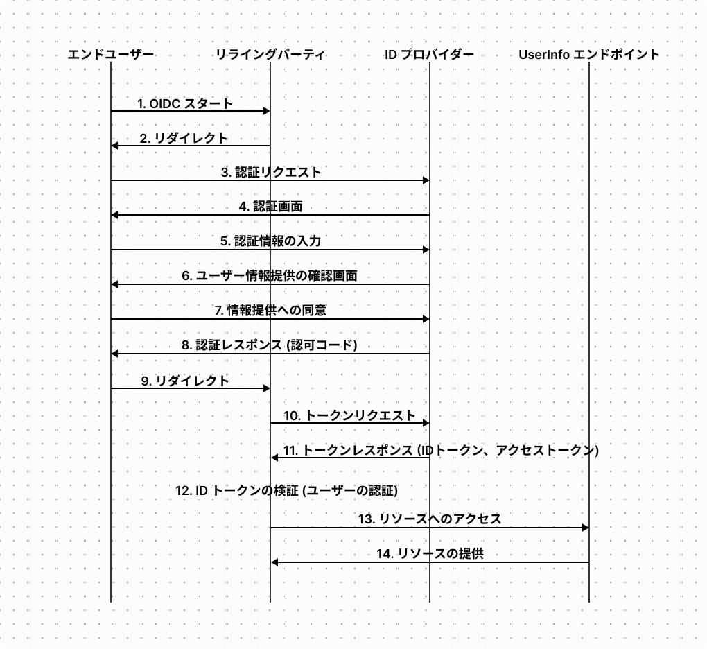
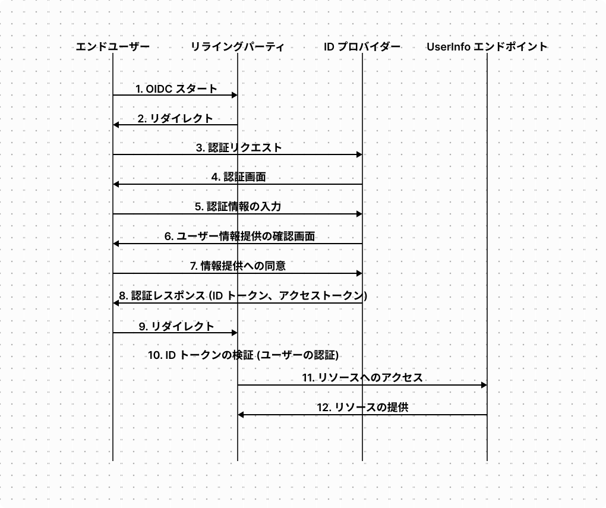
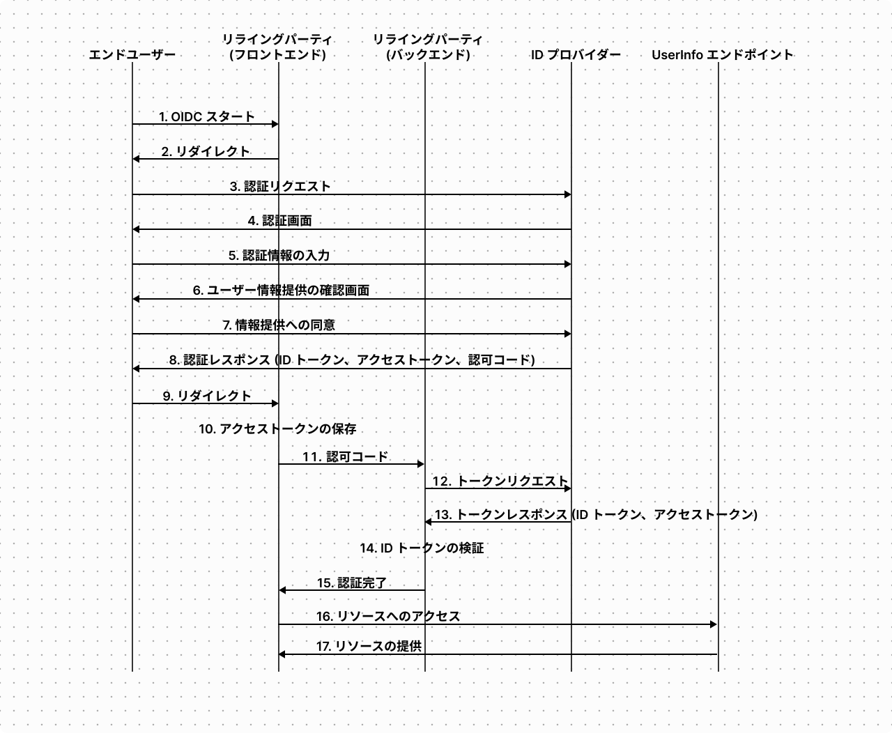

OpenID Connect に入門したので、仕様をまとめる。

<!--truncate-->

## OpenID Connect (OIDC) とは

OpenID Connect は OAuth 2.0 の上で動作する認証のためのプロトコル。

:::note
[https://openid.net/specs/openid-connect-core-1_0.html](https://openid.net/specs/openid-connect-core-1_0.html)

> OpenID Connect 1.0 is a simple identity layer on top of the OAuth 2.0 protocol.

:::

## OIDC の用語

- **エンドユーザー**  
  OIDC によって認証されるユーザー。OAuth の用語ではリソースオーナー。OIDC にはリソースの概念がないのでリソースオーナーではなくエンドユーザーと呼ばれる。

- **リライングパーティ (RP)**  
  OIDC を使ってエンドユーザーを認証するアプリケーション。OAuth の用語ではクライアント。

- **ID プロバイダー (IdP)**  
  ID トークンとアクセストークンを発行するシステム。OAuth の用語では認可サーバー。OpenID Provider (OP) とも呼ばれる。

- **UserInfo エンドポイント**  
  エンドユーザーの情報を提供するエンドポイント。OAuth の用語ではリソースサーバー。  
  UserInfo エンドポイントは認証のために使用するのではなく、認証以外の目的でユーザー情報を利用する際に利用する点に注意。エンドユーザーの認証自体は ID トークンを用いて行われる。

- **スコープ**  
  OAuth におけるスコープと同じ。  
  リライングパーティに対してどんな権限を許可するかを制御する仕組み。

- **アクセストークン**  
  IdP が生成し、リライングパーティが UserInfo エンドポイントにアクセスするために使用するトークン。OAuth のアクセストークンと同じ。

- **ID トークン**  
  IdP が生成し、リライングパーティがエンドユーザーを認証するために使用するトークン。これは OAuth には存在しない。

## OIDC のフロー

OIDC には以下の 3 つのフローが存在する。

- **認可コードフロー**  
  クライアント ID とクライアントシークレットをセキュアに保存できる（=コンフィデンシャル）リライングパーティに適したフロー。

- **インプリシットフロー**  
  クライアント ID とクライアントシークレットを安全に保存できないパブリックなリライングパーティで使用するフロー。

- **ハイブリットフロー**  
  パブリックなリライングパーティとコンフィデンシャルなリライングパーティの両方で構成されるシステムで使用するフロー。

### 認可コードフロー

認可コードフローは以下の流れで実行される。なお、アクセストークンの発行時に ID トークンが一緒に発行される点以外は、OAuth 2.0 の認可コードグラントのフローと同じ。



#### 0.リライングパーティの登録

IdP を提供する組織に対してリライングパーティを登録する。リライングパーティを登録すると、クライアント ID とクライアントシークレットが発行される。

#### 1. OIDC スタート

エンドユーザーがリライングパーティに対して OIDC のスタートをトリガーする。これは例えばエンドユーザーが「Google アカウントでログイン」ボタンを押す操作が該当する。

#### 2. リダイレクト

リライングパーティによって IdP の認可エンドポイントにリダクレクトされる。  
例えば Google の認可エンドポイントは以下にある。

- [https://accounts.google.com/o/oauth2/v2/auth](https://accounts.google.com/o/oauth2/v2/auth)

#### 3. 認証リクエスト

エンドユーザーが認可エンドポイントに認証リクエストを送信する。  
認証リクエストには OAuth の認可リクエストでは付与しなかった nonce が追加されている。

```
GET /o/oauth2/v2/auth
  ?response_type=code
  &scope=<scope>
  &client_id=<client_id>
  &state=<state>
  &redirect_uri=<redirect_uri>
  &nonce=<nonce> HTTP/1.1
Host: auth.example.com
```

各クエリパラメーターには以下の値を指定する。

| 項目          | 値                                                                                                    |
| ------------- | ----------------------------------------------------------------------------------------------------- |
| response_type | 「code」を指定。この値によって IdP にリライングパーティが認可コードの発行を求めていることを知らせる。 |
| scope         | リライングパーティが要求するスコープを指定。指定する値については後述。                                |
| client_id     | リライングパーティを登録した際に発行されたクライアント ID を指定。                                    |
| state         | リライングパーティが生成したランダムな値を設定。                                                      |
| redirect_uri  | リライングパーティを登録した際に指定したリダイレクト URI を指定。                                     |
| nonce         | リライングパーティが生成したランダムな値を指定。                                                      |

OIDC では OAuth とは違い scope の値が仕様で規定されており、以下の値が利用できる。

| 値      | 対応するデータ                                         | 必須 / 任意 |
| ------- | ------------------------------------------------------ | ----------- |
| openid  | OpenID Connect のリクエストであることを示す。          | 必須        |
| profile | プロフィールデータへのアクセス権限。                   | 任意        |
| email   | email、email_verified へのアクセス権限。               | 任意        |
| address | address へのアクセス権限。                             | 任意        |
| phone   | phone_number、phone_number_verified へのアクセス権限。 | 任意        |

#### 4. 認証画面、5. 認証情報の入力

IdP がエンドユーザーを認証する。  
認証の方法は OIDC の仕様では規定されておらず、ユーザー名とパスワードの入力、二要素認証、生体認証などを利用してよい。リソースオーナーが既に認可サーバーの提供するサービスでログイン済みの場合はこの処理は省略され得る。

#### 6. ユーザー情報提供の確認画面、7. 情報提供への同意

IdP からエンドユーザーに対して、スコープで指定されたユーザー情報をリライングパーティに開示することに対する同意画面が送信される。
エンドユーザーが同意する旨の操作をすることで、これを知らせるためのリクエストがエンドユーザーから IdP に送信される。

#### 8. 認証レスポンス、9. リダイレクト

IdP が事前に登録されたリダイレクト URI 向けの 302 レスポンスを返す。

```
HTTP/1.1 302 Found
Location: <redirect_uri>
  ?code=<authorization_code>
  &state=<state>
```

リダイレクト URI には以下のクエリパラメーターが含まれている。

| 項目  | 値                                                                               |
| ----- | -------------------------------------------------------------------------------- |
| code  | 認可コード。後続の処理でアクセストークンと ID トークンを取得するために使用する。 |
| state | 認可リクエストを送信時にリライングパーティで生成した state。                     |

#### 10. トークンリクエスト

リライングパーティから IdP のトークンエンドポイントに、アクセストークンと ID トークンを取得するためのリクエストが送信される。例えば Google のトークンエンドポイントは以下にある。

- [https://oauth2.googleapis.com/token](https://oauth2.googleapis.com/token)

```
POST /token HTTP/1.1
Host: oauth2.googleapis.com
Authorization: Basic <base64 encoded "<client_id>:<client_secret>">
Content-Type: application/x-www-form-urlencoded

grant_type=authorization_code
&code=<authorization_code>
&redirect_uri=<redirect_uri>
```

リクエストには以下のパラメーターが含まれている。

| 項目          | 値                                                                                                                               |
| ------------- | -------------------------------------------------------------------------------------------------------------------------------- |
| client_id     | リライングパーティを登録した際に発行されたクライアント ID を指定。                                                               |
| client_secret | リライングパーティを登録した際に発行されたクライアントシークレットを指定。                                                       |
| grant_type    | 「authorization_code」を指定。この値でリライングパーティが認可コードフローを使用していることを IdP に通知する。                  |
| code          | 認可コード。IdP はこの認可コードに紐づいた認証リクエストで要求されたスコープに対応するアクセストークンと ID トークンを発行する。 |
| redirect_uri  | リライングパーティを登録した際に指定したリダイレクト URI を指定。                                                                |

IdP はリライングパーティが Authorization ヘッダーを使用せずに、リクエストボディにクライアント ID とクライアントシークレットを含めることをサポートしてもよい (MAY)。

```
POST /token HTTP/1.1
Host: oauth2.googleapis.com
Content-Type: application/x-www-form-urlencoded

grant_type=authorization_code
&code=<authorization_code>
&redirect_uri=<redirect_uri>
&client_id=<client_id>         # client_id をボディに記述
&client_secret=<client_secet>  # client_secret をボディに記述
```

Authorization ヘッダーを使用しない場合、リライングパーティは client_secret パラメーターを含めなくても良い。これはパブリックなリライングパーティで認可コードフローを使用する場合に、リライングパーティに保持されたクライアントシークレットがリバースエンジニアリングによって漏洩するのを防ぐことを考慮しているため。

#### 11. トークンレスポンス (ID トークン、アクセストークン)

IdP が ID トークンとアクセストークン、アクセストークンの有効期限、リフレッシュトークンを含むレスポンスをリライングパーティに送信する。

```
HTTP/1.1 200 OK
Content-Type: application/json;charset=UTF-8
Cache-Control: no-store
Pragma: no-cache

{
  "access_token": <access_token>,
  "token_type": "Bearer",
  "expires_in": <expiration_time (seconds)>,
  "refresh_token": <refresh_token>,
  "id_token": <id_token>
}
```

レスポンスボディには以下のパラメータが含まれる。

| 項目          | 値                                                                                                             |
| ------------- | -------------------------------------------------------------------------------------------------------------- |
| access_token  | アクセストークン。リライングパーティは UserInfo エンドポイントへのリクエストにこのトークンを含める必要がある。 |
| token_type    | 「Bearer」。これはアクセストークンが Bearer トークンであることを示す。                                         |
| expires_in    | アクセストークンの有効期限が秒単位で記述されている。                                                           |
| refresh_token | リフレッシュトークン。リライングパーティがアクセストークンの再発行を要求するリクエストにこのトークンを含める。 |
| id_token      | ID トークン。リライングパーティはこのトークンを検証することでエンドユーザーを認証する。                        |

#### 12. ID トークンの検証

ID トークンは RFC7519 で仕様が定義されている JSON Web Token (JWT (ジョット)) というデータ形式で構成される。  
JWT は「ヘッダー」「ペイロード」「署名」の 3 つのパートで構成されており、各パートは「.」で区切られている。

```
<ヘッダー>.<ペイロード>.<署名>
```

ヘッダーは Base64URL エンコードされた以下の JSON 形式。

```
{
  "typ": "JWT",     # JWT であることを表す
  "alg": "RS256"    # 署名に使用されているアルゴリズムを表す。RS256 は RSA + SHA256。
  "kid": "<key id>" # alg が "RS256" である場合の公開鍵の ID。公開鍵の公開方法については RFC7517 で規定されている。
}
```

ペイロードは Base64URL エンコードされた以下の JSON 形式。(代表的な値のみ記載)。

```
{
  "iss": "<ID トークンの issuer の URL>",
  "aud": "<リライングパーティのクライアント ID>",
  "sub": "<エンドユーザーの識別子>",
  "iat": "<JWT の発行時刻>",
  "exp": "<ID トークンの有効期限>",
  "nonce": "<ランダム文字列>"
}
```

リライングパーティは各項目の値を以下の用途で利用する。

| 項目  | 用途                                                                                  |
| ----- | ------------------------------------------------------------------------------------- |
| iss   | IdP の URL であることを確認しなければならない。                                       |
| aud   | リライングパーティ自身のクライアント ID であることを確認しなければならない。          |
| sub   | エンドユーザーの識別子として利用しなければならない。                                  |
| iat   | ID トークンの発行時刻を知るために利用。                                               |
| exp   | ID トークンを受け取った時刻が記載された有効期限より前であることを確認するために利用。 |
| nonce | 認証リクエストに含めた nonce の値と一致することを確認するために利用。                 |

署名は「\<ヘッダー\>.\<ペイロード\>」の値を Base64URL エンコードしたデータに対する署名を Base64URL エンコードした値。  
リライングパーティは IdP が提供する公開鍵を利用して署名を検証することで JWT の改ざんを検知する。

リライングパーティはエンドユーザーの sub の値を使って自身のデータベースを検索し、過去に登録されたユーザーであればログイン処理を完了する。  
初めてログインするユーザーであれば、データベースに sub の値を登録する。

#### 13. リソースへのアクセス、14. リソースの提供

リライングパーティが UserInfo エンドポイントにエンドユーザーの情報を要求する。 例えば Google の UserInfo エンドポイントは以下にある。

- [https://openidconnect.googleapis.com/v1/userinfo](https://openidconnect.googleapis.com/v1/userinfo)

OIDC では UserInfo エンドポイントへのリクエストとレスポンスの形式が仕様で規定されている。  
リクエストは GET もしくは POST を使用し、Authorization ヘッダーとしてアクセストークンを含める。

```
GET /v1/userinfo HTTP/1.1
Host: openidconnect.googleapis.com
Authorization: Bearer <Access Token>

```

レスポンスの例。

```
HTTP/1.1 200 OK
Content-Type: application/json

{
  "sub": "<エンドユーザーの識別子>",
  "name": "<エンドユーザーの名前>",
  "preferred_username": "<エンドユーザーのユーザー名>",
  "email": "<エンドユーザーのメールアドレス>",
  "picture": "<エンドユーザーの画像>"
}
```

### インプリシットフロー

インプリシットフローは以下の流れで実行される。



以下では認可コードフローと同じメッセージは省いて、インプリシットフローで違いがある箇所のみまとめる。

#### 3. 認証リクエスト

エンドユーザーが認可エンドポイントに認証リクエストを送信する。

```
GET /o/oauth2/v2/auth
  ?response_type=id_token token
  &scope=<scope>
  &client_id=<client_id>
  &state=<state>
  &redirect_uri=<redirect_uri>
  &nonce=<nonce> HTTP/1.1
Host: auth.example.com
```

認可コードフローとの違いは response_type パラメーターの値が「code」ではなく「id_token token」である点のみ。この値によってリライングパーティが IdP に対して ID トークンとアクセストークンの発行を求めていることを知らせる。  
なおアクセストークンを発行する必要がない場合は response_type パラメーターの値は「id_token」のみであっても構わない。

#### 8. 認証レスポンス (ID トークン、アクセストークン)

IdP が事前に登録されたリダイレクト URI 向けの 302 レスポンスを返す。

```
HTTP/1.1 302 Found
Location: <redirect_uri>
  #access_token=<access_token>
  &token_type=bearer
  &expires_in=<expiration_time (seconds)>
  &state=<state>
  &id_token=<id_token>
```

リダイレクト URI には認可コードフローの認可レスポンスにはあった code パラメーターがなくなり、代わりに access_token、token_type、expires_in、id_token パラメーターが含まれている。

また、クエリ「?」ではなくフラグメント「#」であることに注意。これはリダイレクト先にリクエストを送信する際にフラグメントは送信されないため、アクセストークンや ID トークンがリダイレクト先に渡らず、リダイレクト先のウェブサーバーでこれらのトークンが流出することを防ぐことができる。

なお、インプリシットフローではリフレッシュトークンは発行されない。

#### 10. ID トークンの検証 (ユーザーの認証)

インプリシットフローでは認可コードフローの場合に実施する ID トークンの検証に追加して、次の検証を行う必要がある。

認証リクエストの response_type パラメーターに「id_token token」を指定した場合、ID トークンのペイロードには at_hash の項目が追加されている。
at_hash の値は、ID トークンの署名に使用したハッシュアルゴリズムでアクセストークンのハッシュ値を計算し、その左半分を Base64URL エンコードした文字列。
アクセストークンを取得したリライングパーティはこれと同じ方法でハッシュ値を計算し、at_hash の値と一致することを確認する。

これはインプリシットフローではアクセストークンが一度エンドユーザーに渡っているため、このタイミングでアクセストークンの置き換えが発生する可能性があるため。

### ハイブリットフロー

ハイブリットフローではエンドユーザーが認証リクエストを送信する際 response_type として以下の値を指定する。

| 値                    | 用途                                                                                 |
| --------------------- | ------------------------------------------------------------------------------------ |
| `code id_token`       | パブリックなリライングパーティ側で ID トークンのみ使用する場合                       |
| `code token`          | パブリックなリライングパーティ側でアクセストークンのみ使用する場合                   |
| `code id_token token` | パブリックなリライングパーティ側で ID トークンとアクセストークンの両方を使用する場合 |

ハイブリットフローは以下の流れで実行される。



以下では認可コードフローとインプリシットフローと同様なメッセージは省いて、ハイブリットフローで特記すべき部分のみまとめる。

#### 3. 認証リクエスト

エンドユーザーが認可エンドポイントに認証リクエストを送信する。

```
GET /o/oauth2/v2/auth
  ?response_type=code id_token token
  &scope=<scope>
  &client_id=<client_id>
  &state=<state>
  &redirect_uri=<redirect_uri>
  &nonce=<nonce> HTTP/1.1
Host: auth.example.com
```

#### 8. 認証レスポンス (ID トークン、アクセストークン、認可コード)

IdP が事前に登録されたリダイレクト URI 向けの 302 レスポンスを返す。

```
HTTP/1.1 302 Found
Location: <redirect_uri>
  #code=<authorization_code>
  &access_token=<access_token>
  &token_type=bearer
  &expires_in=<expiration_time (seconds)>
  &state=<state>
  &id_token=<id_token>
```

## 参考

- [OAuth、OAuth 認証、OpenID Connect の違いを整理して、理解できる本](https://booth.pm/ja/items/1550861)
