&nbsp;IPv6 について理解した内容をまとめる。

<!--truncate-->

## IPv6 による通信が可能になるまでの処理の流れ

IPv6 による通信が可能になるまでの処理の流れは以下のようになる。

1. **インターフェースの有効化**  
   ネットワークインターフェースが有効になると、IPv6 アドレスの自動設定が開始される。

2. **リンクローカルアドレスの生成**  
   インターフェースはリンクローカルユニキャストアドレスを自動的に生成する。

3. **重複アドレス検出**  
   リンクローカルユニキャストアドレスが他のデバイスと重複していないか確認するために、重複アドレスの検出を行う。

4. **グローバルユニキャストアドレスの生成**  
   ルーターから取得した情報をもとに、グローバルユニキャストアドレスを生成する。

5. **DNS の設定**（任意）  
   ルーターから取得した情報、もしくは DHCPv6 を使用して取得した情報をもとに DNS の設定を行う。

## IPv6 による通信の流れ

IPv6 による通信を行う場合、パケットのフォーマットは異なるものの、パケットの生成、ルーティングテーブルの参照、パケットの送信などおおまかな流れは IPv4 と変わらない。ただし、宛先 IPv6 アドレスに対応する MAC アドレスを取得する処理は ARP を使う IPv4 とは異なる。

IPv6 による通信を行う際、宛先 IPv6 アドレスに対応する MAC アドレスを取得する流れは以下のようになる。

1. **Neighbor Solicitation メッセージの送信**  
   通信を行いたい IPv6 アドレスに対して、送信元ノードから Neighbor Solicitation メッセージを送信する。

2. **Neighbor Advertisement メッセージの受信**  
   対象の IPv6 アドレスを持つノードは、Neighbor Advertisement メッセージで応答する。
   このメッセージには対象の IPv6 アドレスを持つノードの MAC アドレスが含まれる。

## IPv6 による通信が可能になるまでの処理

IPv6 による通信が可能になるまでの処理の詳細をまとめる。

### 1. インターフェースの有効化

ネットワークインターフェースが有効になると、IPv6 アドレスの自動設定が開始される。なお、ネットワークインターフェースが有効になるタイミングには以下が想定される。

- システム起動時、ネットワークインターフェースが初期化される場合
- ネットワークインターフェースに障害が発生し、再度初期化される場合
- システム管理者によってネットワークインターフェースが再度初期化される場合
- システム管理者によってネットワークインターフェースが無効化され、再度有効化された場合
- ネットワークインターフェースが最初にリンクに接続する場合

IPv6 アドレスの自動設定の方法には **SLAAC**（Stateless Address Auto Configuration）を利用する方法と、**DHCPv6** を利用する方法の二種類がある。以降では SLAAC を利用する方法について記載する。

### 2. リンクローカルアドレスの生成

IPv6 アドレスの設定として、最初にリンクローカルユニキャストアドレスが生成される。

#### リンクローカルユニキャストアドレス

**リンクローカルユニキャストアドレス**は、同一のリンク内でのみ使用可能な IPv6 アドレスである。ルーターがリンクローカルユニキャストアドレスが送信元または送信先になっているパケットを他のリンクに転送することは禁止されている（RFC 4291 Section 2.5.6）。  
リンクローカルユニキャストアドレスは「サブネットプレフィックスが 64 ビットで、下位 64 ビットがインターフェース識別子となる IPv6 アドレス `fe80::0/64`」で定義されている。

#### 拡張 EUI-64 形式によるインターフェース識別子の生成

IPv6 アドレスの **インターフェース識別子**とは、IPv4 アドレスでいうところのホスト部のこと。  
SLAAC におけるリンクローカルユニキャストアドレスのインターフェース識別子の生成方法はいくつかあるが、以降ではその一つである**拡張 EUI-64 形式**について記載する。

拡張 EUI-64 形式は 48 ビットである MAC アドレス（EUI-48 形式）から IPv6 アドレスのインターフェース識別子を生成する。  
手順は以下のようになる。

1. MAC アドレスの前半３オクテット（OUI）の後ろに `0xfffe` という 16 ビットを挿入する。
2. MAC アドレスの先頭オクテットの 0x02 のビット（00000010 部分）（u ビット）を反転させる。

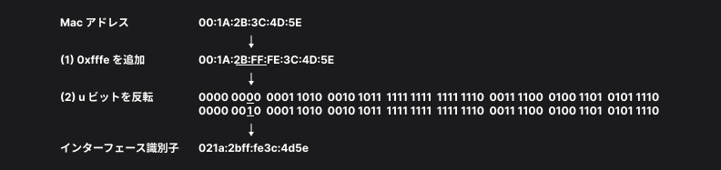

こうしてリンクローカルユニキャストアドレスのサブネットプレフィックス `fe80:0/64` と、拡張 EUI-64 形式で生成したインターフェース識別子を組み合わせて、リンクローカルユニキャストアドレスが生成できる。

### 3. 重複アドレス検出

生成されたリンクローカルユニキャストアドレスが他のデバイスと重複していないか確認するために、**重複アドレス検出（DAD, Duplicate Address Detection）** を行う。具体的には、ICMPv6 のメッセージの一つである **Neighbor Solicitation （NS）メッセージ**を送信し、応答がないことを確認する。

#### IPv6 ヘッダーの構造

IPv6 ヘッダーのフォーマットは以下のように定義されている。

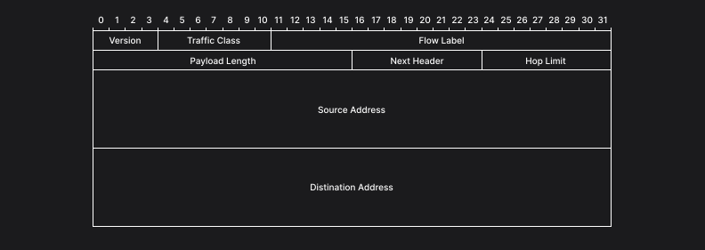

- Version（4 ビット）  
  IPv6 の６を示す `0110` が入る。

- Traffic Class（8 ビット）  
  上位 6 ビットは通信品質の指定を行うための仕組みの一つである DSCP（Dirrerentiated Services Code Point）を格納する DS Field で利用する。
  下位 2 ビットは ECN（Explicit Congestion Notification）で利用される。
  IPv4 ヘッダーの ToS フィールドと同じ用途。

- Flow Label（20 ビット）  
  通信のフローを識別するために使うフローラベルを設定する。  
  IPv4 で「送信元 IP アドレス」「宛先 IP アドレス」「送信元ポート番号」「送信先ポート番号」「トランスポートプロトコルの種類」の 5 つの情報で識別されていた通信のフローを明示的に識別するためのラベル。

- Payload Length（16 ビット）  
  IPv6 ヘッダーの後に続くペイロードの長さを示す。  
  Payload Length フィールドの値には IPv6 ヘッダーの長さは含まれない。
  IPv6 ヘッダーの長さ 40 バイトを足した値が IPv6 パケット全体の長さになる。
  ただし、IPv6 ヘッダーに続く IPv6 拡張ヘッダーが存在する場合、それらの IPv6 拡張ヘッダーの長さは Payload Length に含まれる。
  IPv4 ヘッダーの Total Length フィールドはヘッダーの長さも含むので注意。  
  Payload Length フィールドは 16 ビットであるため、表現できる最大長は 65,536 バイトになる。
  別途 IPv6 Jumbogram という仕組みがあり、IPv6 拡張ヘッダーの Hop-by-Hop オプションを利用することで、これ以上のペイロードを持つ IPv6 パケットも利用が可能。

- Next Header（8 ビット）  
  IPv6 ヘッダーの直後に続くヘッダーを IANA が割り当てているプロトコル番号で示す。TCP は `6`、UDP は `17`、ICMPv6 なら `56` など。IPv6 拡張ヘッダーが IPv6 ヘッダーの後に続く場合は、IPv6 拡張ヘッダーの種類に応じた番号が入る。

- Hop Limit（8 ビット）  
  IPv6 パケットが転送される上限のホップ数を示す。IPv6 パケットを送信する機器が値を設定し、IPv6 パケットが転送されるたびに 1 減算され、0 になると IPv6 パケットが破棄される。

- Source Address（128 ビット）  
  IPv6 パケットが生成された送信元 IPv6 アドレスを示す。

- Destination Address（128 ビット）  
  IPv6 パケットの宛先 IPv6 アドレスを示す。

#### ICMPv6 Neighbor Solicitation（NS）メッセージの構造

ICMPv6 メッセージは IPv6 パケットのペイロードとして転送され、以下のフォーマットになっている。

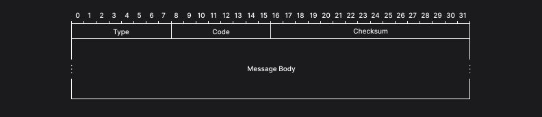

- Type（8 ビット）  
  ICMPv6 のメッセージの種類を示す。

- Code（8 ビット）  
  Type フィールドの値ごとに定義されている。各 Type を更に分類するために利用される。

- Checksum（16 ビット）  
  疑似 IPv6 ヘッダーと ICMPv6 メッセージ全体に対して計算した Checksum。
  IPv4 における ICMP では疑似 IPv4 ヘッダーを含めない点に違いがあるので注意。
  計算方法は TCP や UDP の Checksum の計算方法と同じ。

- Message（可変長）  
  ICMPv6 メッセージごとに異なる。

ICMPv6 Neighbor Solicitation（NS）メッセージの場合は以下の構造になる。

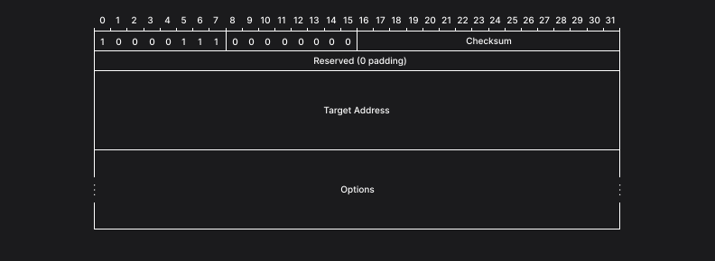

- Type（8 ビット）  
  135（`10000111`）を指定。

- Code（8 ビット）  
  0（`00000000`）を指定。

- Reserved（32 ビット）  
  0 を指定。受信側はこのフィールドを無視する必要がある。

- Target Address（128 ビット）  
  対象となる IPv6 アドレスを指定。

- Options（可変長）  
  オプションを含めるフィールド。NS メッセージには Source Link-layer Address を使って、送信者のリンク層のアドレスを含めることができる。

#### Neighbor Solicitation メッセージの送信

DAD のために NS メッセージを送信する場合、送信元 IPv6 アドレスには **未定義アドレス** `::/128` を使用し、宛先 IPv6 アドレスは重複していないことを確認したい IPv6 アドレスに対応する **Solicited-Node マルチキャストアドレス** を使用する。Solicited-Node マルチキャストアドレスは上位 104 ビットを `ff02::1:ff00:0` として、下位 24 ビットをユニキャストアドレスもしくはエニーキャストアドレスの下位 24 ビットにしたアドレス。

なお、この時 NS メッセージを送信するノードは、NS メッセージを送信する前に、**全ノードマルチキャストグループ** および確認したい IPv6 アドレスに対する **Solicited-Node マルチキャストグループ** に参加しておく必要がある。全ノードマルチキャストグループに参加することで、既にその IPv6 アドレスを利用している **Neighbor Advertisement（NA）メッセージ**を受け取れるようになり、また Solicited-Node マルチキャストグループに参加することで、他のノードが同じタイミングで同じ IPv6 アドレスに対する DAD を行っている状態を検知できるため。

DAD では、NS メッセージを一定の回数送信した後、あらかじめ設定したミリ秒が経過するのを待って、競合する IPv6 アドレスが同一リンク上に存在しないと判断する。

NS メッセージの送信回数は DupAddrDetectTransmits 変数としてノードで設定可能。デフォルト値は 1。この値を 0 に設定すれば DAD を実行しないことを示す。

NS メッセージ送信後の待ち時間は RetransTimer 変数として管理する。デフォルト値は 1000 ミリ秒。

#### IPv6 マルチキャストの仕組み

IP マルチキャストでは 0 以上のノードで構成されるグループに対して IP パケットを送信する仕組み。この時の宛先 IP アドレスは、そのグループを指す 1 つの IP アドレスを使用する。

このグループのことを **マルチキャストグループ** といい、マルチキャストグループを指す IP アドレスを **マルチキャストアドレス** という。

マルチキャストの受信側は、ICMPv6 の MLD（Multicast Listener Discovery）メッセージの 1 つである **Multicast Listener Report メッセージ**をルーターに送信することで、そのマルチキャストグループに参加する。また、**Multicast Listener Done メッセージ**をルーターに送信することで、そのマルチキャストグループから離脱する。

ルーターはマルチキャストの受信者がリンク上に存在しているかを確認するために **Multicast Listener Query メッセージ**を送信する。これを受信したノードは、自分が参加しているマルチキャストグループを Multicast Listener Report メッセージで送信する。

### 4. グローバルユニキャストアドレスの設定

グローバルユニキャストアドレスの設定には、ルーターが送信する ICMPv6 の Router Advertisement（RA）メッセージを利用する。

#### Router Advertisement メッセージの構造

RA メッセージはルーターが定期的に送信している。またノードが Router Solicitation（RS）メッセージを送信することでルーターに RA メッセージの送信を要求することもできる。

RA メッセージのフォーマットは以下。

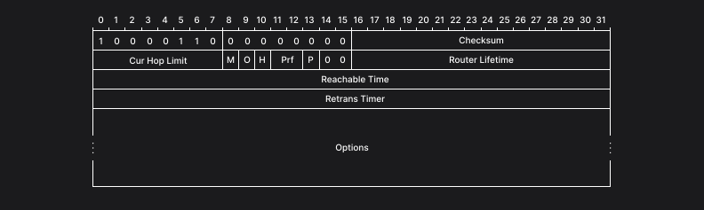

- Type（8 ビット）  
  134（`10000110`）を指定。

- Code（8 ビット）  
  0（`00000000`）を指定。

- Cur Hop Limit（8 ビット）  
  RA メッセージを送信しているルーターを通じて転送されていく IPv6 パケットの Hop Limit フィールドについて、ルーターが推奨する値を示す。推奨値を指定しない場合は `0` を指定する。

- M（1 ビット）  
  「Managed address configuration」を意味するフラグ。
  DHCPv6 による IPv6 アドレス設定が利用可能であることを `1` で示す。
  ただし、このフラグが `0` である場合でも DHCPv6 を利用することが禁止されているわけではない。

- O（1 ビット）  
  「Other configuration」を示すフラグ。
  IPv6 アドレス以外の情報を DHCPv6 で取得することが可能である場合は、`1` を指定する。
  例えば DNS に関する情報が DHCPv6 で提供している場合など。
  M フラグと同様に、O フラグが `0` である場合でも DHCPv6 の利用が禁止されているわけではない。

- H（1 ビット）  
  「Mobile IPv6 Home Agent」を示すフラグ。

- Prf（2 ビット）  
  「Default Router Preference」を示すフラグ。

- P（1 ビット）  
  「Default Router Preference」を示すフラグ。

- 予約（2 ビット）  
  未使用領域。この値は 0 であることが求められる。

- Router Lifetime（16 ビット）  
  RA メッセージを送信しているルーターがデフォルトルーターとして有効な期間をホストに伝えるためのフィールド。
  16 ビットの符号なしの整数により、`0` ~ `65535` までの秒単位で指定する。
  このフィールドの値が `0` である場合は、自身をデフォルトルータとして利用してはならないことをホストに対して示す。

- Retrans Timer（32 ビット）  
  ノードが NS メッセージを送信した後の待ち時間として設定する RetransTimer 変数の推奨値。ノードは RA メッセージの Retrans Timer フィールドの値をコピーして使用することが推奨されている。
  符号なしの整数で単位はミリ秒。
  `0` の場合は、このルータでは未定義という意味を持つ。

- Options（可変長）  
  0 個以上のオプションを含めるフィールド。

#### Options フィールドの構造

RA メッセージのオプションのフォーマットは以下のようになる。

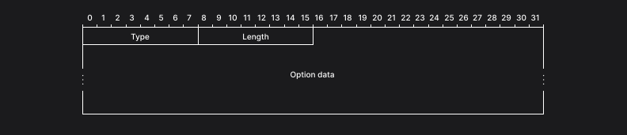

- Type（8 ビット）  
  オプションのタイプを示す。

- Length（8 ビット）  
  Type フィールドと Length フィールドを含めた、オプション全体の長さを 8 ビットの符号なし整数で示す。
  この値は 8 オクテット単位。つまり Length フィールドの値が `2` の場合、オプションの長さは 2 x 8 オクテット = 16 オクテットとなる。
  RFC4861 では、オプションが 64 ビットの境界で終端するように、必要に応じてパディングすることが推奨されている。

Router Advertisement メッセージに含められる主なオプションには以下がある。

- Source Link-layer Address オプション
- MTU オプション
- Prefix Information オプション
- RDNSS オプション
- DNSSL オプション

#### Prefix Information オプションの構造

Prefix Information オプションは、RA メッセージに含まれ、ネットワークのプレフィックスを広告するためのオプション。フォーマットは以下のようになる。

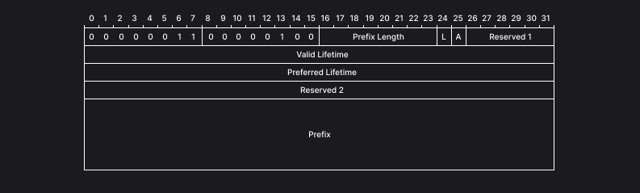

- Type（8 ビット）  
  3（`00000011`）を指定。

- Length（8 ビット）  
  Type フィールドと Length フィールドを含めて 32 オクテットであるため、4（`00000100`）を指定。

- Prefix Length（8 ビット）  
  プレフィックスの長さを示す符号なし整数。0 ~ 128（`00000000` ~ `10000000`）の値。

- L（1 ビット）  
  `1` の場合、on-link（同一のリンクに接続されている）の IPv6 アドレスであることを示す。  
  IPv6 では 1 つのネットワークインターフェースに複数の IPv6 アドレスが付与できるため、ネットワークプレフィックスが異なるアドレスでも同一リンクに接続されている可能性があり、この場合ルーターを介さずに通信することが可能。

- A（1 ビット）  
  `1` の場合、このプレフィックスが SLAAC で使用できることを示す。

- Reserved 1（6 ビット）  
  未使用。このフィールドは `0` であることが求められる。

- Valid Lifetime（32 ビット）  
  このプレフィックスがリンク上で有効となる時間を符号なし整数で秒単位で示す。
  32 ビット全てが `1` である場合、無制限であることを示す。

- Preferred Lifetime（32 ビット）  
  SLAAC によって生成されたアドレスが preferred 状態である時間を符号なし整数で秒単位で示す。
  Valid Lifetime を超えない値であることが求められる。
  32 ビット全てが `1` である場合、無制限であることを示す。

- Reserved 2（32 ビット）  
  未使用。このフィールドは `0` であることが求められる。

- Prefix（128 ビット）  
  IPv6 アドレス、もしくは IPv6 アドレスのプレフィックスを示す。

#### IPv6 アドレスの状態遷移

自動生成される IPv6 アドレスは以下の 4 つの状態を遷移する。

1. tentative
2. preferred
3. deprecated
4. invalid

IPv6 アドレスが自動生成された時点では、その IPv6 アドレスは tentative 状態。
DAD の実施によりアドレスの重複がないことが確認されると preferred 状態に遷移する。
IPv6 アドレスが自動生成されてから Preferred Lifetime で指定の秒数が経過すると deprecated 状態に遷移する。
IPv6 アドレスが自動生成されてから Valid Lifetime で指定の秒数が経過すると invalid 状態に遷移する。

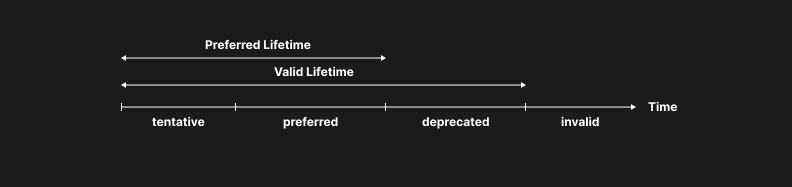

tentative 状態と preferred 状態の IPv6 アドレスは無効。preferred 状態と deprecated 状態の IPv6 アドレスは有効。ただし deprecated 状態の IPv6 アドレスは既存の TCP 接続などでは使い続けて良いが、新規の通信では送信元 IPv6 アドレスとして利用することは避け、preferred 状態の IPv6 アドレスを使用すべき。

ノードが RA メッセージから IPv6 アドレスを設定した場合、設定後に新たな RA メッセージを受信することで Preferred Lifetime の値は更新されることがある。

#### グローバルユニキャストアドレスの設定

ノードはルーターから RA メッセージを受信し、メッセージ内の Prefix Information オプションからプレフィックスを取得する。このプレフィックスに自動生成済みのインターフェース識別子を組み合わせることでグローバルユニキャストアドレスを生成する。

### 5. DNS の設定（任意）

RA メッセージには **RDNSS（Recursive DNS Server）オプション**と **DNSSL（DNS Search List）オプション**を指定することができる。これらのオプションを使って、ノードは DNS の設定を行うことができる。

#### RDNSS オプションの構造

RDNSS オプションは RA メッセージに DNS サーバの IPv6 アドレスを含めるために利用する。
RDNSS オプションのフォーマットは以下のようになっている。

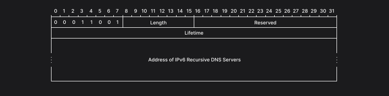

- Type（8 ビット）  
  25（`00011001`）を指定。

- Reserved（16 ビット）  
  未使用。このフィールドは `0` であることが求められる。

- Lifetime（32 ビット）  
  このオプションが示す DNS サーバーを使っても良い期間を 32 ビット符号なし整数で秒単位で示す。
  全てのビットが `1` の場合は無制限であることを示す。
  `0` は記載された DNS サーバーをそれ以降使用してはならないことを示す。

- Address of IPv6 Recursive DNS Servers（可変長）  
  DNS サーバーの IPv6 アドレスを示す。
  このフィールドに含まれる IPv6 アドレスの数は Length フィールドの値から求められる。
  1 つの RDNSS オプションで複数の DNS サーバーの IPv6 アドレスに対する個別の Lifetime を表現することはできないが、こレヲ実現したい場合は 1 つの RA メッセージに複数の RDNSS オプションを付与することで実現可能。

#### DNSSL オプションの構造

DNSSL オプションは DNS suffix search list を提供するためのオプション。  
例えば、`http://www/` としたときに、DNSSL オプションに `example.com` が設定されていれば、自動的に `http://www.example.com/` であると解釈された上で処理される。  
DNSSL オプションのフォーマットは以下のようになっている。

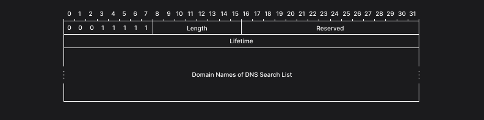

- Type（8 ビット）  
  31（`00011111`）を指定。

- Reserved（16 ビット）  
  未使用。このフィールドは `0` であることが求められる。

- Lifetime（32 ビット）  
  このオプションが示す DNS suffix search list を使っても良い期間を 32 ビット符号なし整数で秒単位で示す。
  全てのビットが `1` の場合は無制限であることを示す。
  `0` は記載された DNS suffix search list をそれ以降使用してはならないことを示す。

- Domain Names of DNS Search List（可変長）  
  1 つ以上のドメインを含める。
  ドメイン名は文字列ではなく `.` で分割したラベルの列として表現される。
  例えば、`example.com` は `example` と `com`、ルートを示す空のラベルの 3 つで表され、各ラベルの先頭にはラベルの長さが記載される。

## IPv6 による通信

IPv6 による通信を行う場合の処理の詳細をまとめる。

### 1. Neighbor Solicitation メッセージの送信

IPv6 による通信では、通信を行いたい IPv6 アドレスに対応するリンク層のアドレスを解決するために、NS メッセージを送信する。
この時の送信元 IPv6 アドレスはネットワークインターフェースに設定されている IPv6 アドレスとし、宛先 IPv6 アドレスは対象となる IPv6 アドレスに対応した Solicited-Node マルチキャストアドレスを指定する。

### 2. Neighbor Advertisement メッセージの受信

NS メッセージを受信したノードは、NS メッセージの返答として Neighbor Advertisement（NA）メッセージを送信する。

NA メッセージは以下のフォーマットになる。

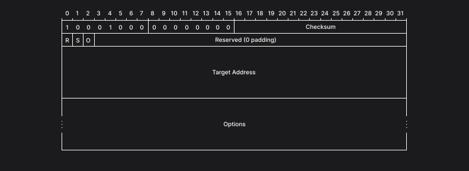

- R（1 ビット）  
  このフラグが `1` の場合、NA メッセージの送信元がルーターであることを示す。

- S（1 ビット）  
  このフラグが `1` の場合、NS メッセージに対する返答であることを示す。

- O（1 ビット）  
  Override を意味するフラグ。
  近隣キャッシュに登録されているリンク層アドレスの上書きを推奨する場合 `1` を指定する。
  このフラグが設定されていない場合、近隣キャッシュに登録済みのエントリが NA メッセージの情報で更新されることはない。

- Reserved（29 ビット）  
  未使用。このフィールドは `0` であることが求められる。

- Target Address（可変長）  
  NS メッセージに対する返答の場合、NS メッセージの Target Address フィールドに記載されている IPv6 アドレスを指定する。  
  リンク層アドレスの変更を伝える自発的な NA メッセージの場合は、このフィールドに、変更のあったリンク層アドレスに対応する IPv6 アドレスを指定する。
